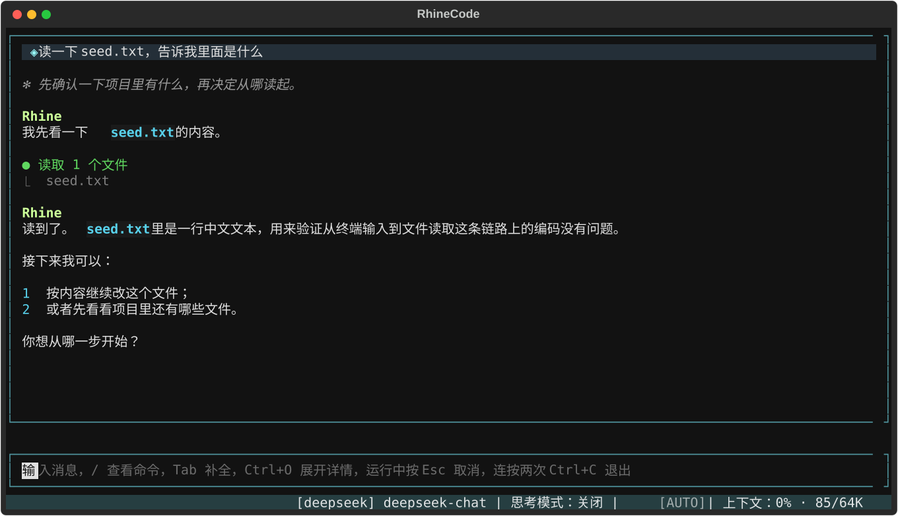
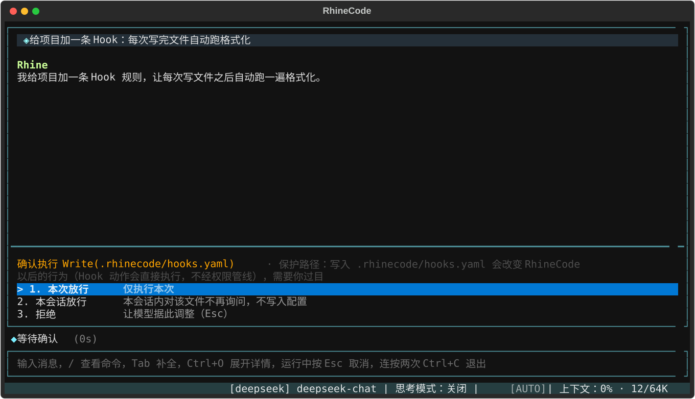
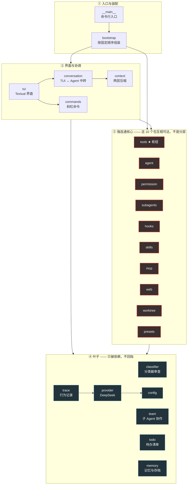
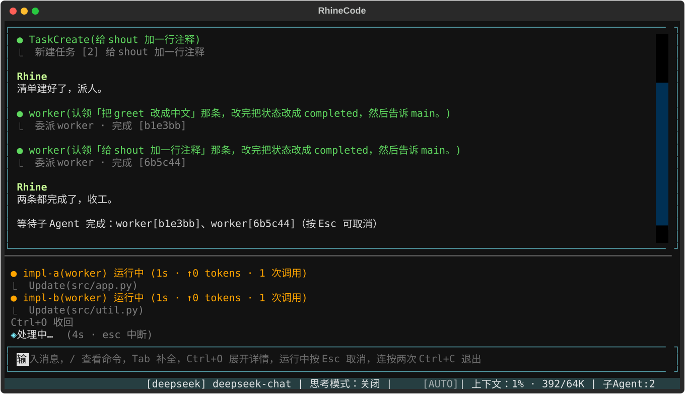

# RhineCode

[](https://github.com/504223641/RhineCode-Agent/actions/workflows/ci.yml)
[](https://github.com/504223641/RhineCode-Agent/blob/main/pyproject.toml)
[](LICENSE)
[](docs/guide/testing.md)

**在终端里跑的 AI 编程助手。** 你用中文说要做什么，它自己读文件、搜代码、改代码、
跑命令，边做边把每一步显示给你看——危险的动作会先停下来问你。
用 Python + [Textual](https://textual.textualize.io/) 写成，交互体验参考 Claude Code。



---

## 30 秒跑起来

需要 **Python 3.11+** 和一个 [DeepSeek](https://platform.deepseek.com/) API Key。

```bash
git clone https://github.com/504223641/RhineCode-Agent.git
cd RhineCode-Agent
pip install -e .

rhine          # 第一次运行会在 ~/.rhinecode/ 生成配置模板并告诉你去哪填 key
```

在 `~/.rhinecode/config.yaml` 里填上 `api_key`，然后 **`cd` 到你自己的项目目录**、
再敲一次 `rhine` 就开始了——当前目录就是它能操作的范围。

```yaml
protocol: deepseek
model: deepseek-chat
base_url: https://api.deepseek.com
api_key: sk-你的密钥
```

> 同时生成的还有 `permissions.yaml` / `mcp.yaml` / `hooks.yaml` 三份可选配置，
> 模板内容**全是注释、默认不生效**，想用时取消注释即可。
> 完整字段与三层配置的优先级见 [安装、配置与启动](docs/guide/getting-started.md)。

**本项目只支持 DeepSeek 一个 Provider。** `protocol` 字段刻意保留（环境信息、状态栏、
行为记录都在读它），但填成已删除的 `anthropic` / `openai` 会在启动时报错并给出迁移说明。
⚠ `openai` 这个 pip 依赖**不能删**——DeepSeek 走的就是 OpenAI 兼容协议。

---

## 它能做什么

<table>
<tr><td width="50%" valign="top">

**🔁 自己跑完一整件事**
调模型 → 执行工具 → 把结果喂回去 → 再调模型，直到事情做完。
读文件、glob 找文件、grep 搜内容、写文件、精确编辑、跑命令、抓网页、搜网络。
→ [工具能力](docs/guide/tools.md)

</td><td width="50%" valign="top">

**🛡️ 五层防御的权限系统**
每次工具执行前由**代码**（不是模型、不是 prompt）算「放行 / 拒绝 / 问你」。
危险命令黑名单不可被任何配置放开，路径沙箱是物理边界。
→ [权限系统](docs/guide/permissions.md)

</td></tr>
<tr><td valign="top">

**🧑‍🤝‍🧑 子 Agent：委派、隔离、协作**
把子任务交给独立上下文的子 Agent，只拿回结论——不必把二十个文件堆进你的对话。
声明一行 `isolation: worktree` 它就在**独立的 Git 工作目录**里跑，和你同时改文件也不打架。
多个队员能读写同一份任务看板、互相发消息。
→ [子 Agent](docs/guide/subagents.md)

</td><td valign="top">

**📋 计划模式：先商量，再动手**
`Shift+Tab` 切到 `plan`，它只做只读调研、弹面板跟你确认要点，
把完整计划摆出来等你批准，**批准之前一个字都不写**。
→ [Plan Mode](docs/guide/permissions.md#plan-mode)

</td></tr>
<tr><td valign="top">

**📦 Skill：把重复的提示词存成文件**
一个 `.md` 文件 = 一套可复用的干活流程，自动注册成 `/<名字>` 短命令。
**已对齐 [Agent Skills 开放标准](https://agentskills.io)**——从 Claude Code
拷一个 Skill 目录进来就能直接用。
→ [Skill 系统](docs/guide/skills.md)

</td><td valign="top">

**🪝 Hook：在固定节点挂自动化**
「事件 + 条件 + 动作」写进 `hooks.yaml`。十二个生命周期事件、四种动作。
`pre_tool_use` 能**拦截**工具调用，且**只能收紧不能放宽**。
→ [Hook 系统](docs/guide/hooks.md)

</td></tr>
<tr><td valign="top">

**🧠 记不住就写下来**
三层 `RHINE.md` 项目指令、每条消息即时存档（`--continue` 接着上次跑）、
自然停止后异步沉淀四类记忆。上下文快满时两层压缩自动接管，聊多久都不会撑爆。
→ [记忆](docs/guide/memory.md) · [上下文](docs/guide/context.md)

</td><td valign="top">

**🔌 MCP 客户端**
启动时连外部 MCP Server（stdio 子进程 / Streamable HTTP），
把远端工具包装成内置工具注册进来，对上层完全无感。
→ [MCP](docs/guide/mcp.md)

</td></tr>
</table>

<details>
<summary><b>还有这些（点开）</b></summary>

- **命令与网络的分类器审查**：跑命令 / 访问网络 / 给队友发消息 / 上网搜索这四类动作，
  执行前先过一个**独立的分类器模型**。它排在权限管线第④层，所以你写的 `deny` 仍压得过它、
  你写的 `allow` 直接短路它。两阶段判定，绝大多数日常命令只花一个 token。
- **网络访问与搜索**：`web_fetch` 取网页正文并按你的提问抽要点（只取不发、受域名白名单约束）；
  `web_search` 给路标。⚠ 两者的外泄面不同——搜索发出去的是**你的问题本身**。
- **待办清单**：多步任务开工前它列几条，做的过程中逐条更新，你在历史区最底下一直看得到还剩什么。
- **澄清提问面板**：卡在「有好几种做法」时弹面板让你点一下，而不是写一串问句干等你打字。
- **斜杠命令**：15 条内置命令，`/help` `/mode` `/context` `/compact` `/resume` `/memory`
  `/skills` `/hooks` `/agents` `/tasks` `/mcp` `/init` `/think` `/clear` `/exit`，
  全部支持 Tab 补全与别名。
- **行为记录（trace）**：`--trace` 把运行过程写成三十一类结构化事件的 JSONL，
  配一个只读阅读器。缺省关闭、不开时一个字节都不写。

完整清单见 [能力清单](docs/guide/features.md)。

</details>

---

## ⚠️ 用之前请先读这一段

**RhineCode 会在你的机器上执行命令、读写文件、访问网络。** 这不是比喻——
它拿到的就是你这个用户的权限。下面几条不是免责声明，是使用前真的要知道的事。

| 它默认能做什么 | 挡住它的是什么 |
| --- | --- |
| 在**当前目录**下读写任意文件 | 路径沙箱（第②层）：`..`、越界绝对路径、指向项目外的符号链接一律拒绝 |
| 执行任意 shell 命令**且默认不弹面板** | ①危险命令黑名单（`rm -rf` / fork 炸弹 / `format` 等，**不可被任何配置放开**）+ C16 分类器审查 |
| 访问网络（抓网页、搜索） | 结构性硬校验（禁 `file://`、禁内网地址）+ 域名白名单；**未建白名单时每次都弹确认** |
| 改自己以后的行为（权限规则、Hook） | ②″保护路径：写 `.rhinecode/` 下的配置与 `.git/` **一律要你过目**，没有开关能关掉 |



**几条具体的**：

1. **缺省是「放手干活」档**（`auto` 预设）。工作区内的文件写入与命令执行**不弹面板**。
   想更严，在 `permissions.yaml` 里写 `deny` 规则，或给子 Agent 角色声明更严的 `permission_mode`
   ——⚠ 运行期已经**没有**切换权限档的入口了。
2. **别把 `config.yaml` 提交到版本库**，里面是明文 API Key。
   `.rhinecode/` 下的会话存档、上下文存盘、行为记录**逐字复刻了对话原文与工具输出**
   （包括模型读过的敏感文件内容），已在 `.gitignore` 里，别提交、别贴进 issue。
3. **项目级的 `.rhinecode/hooks.yaml` 是最大的攻击面**：它随代码仓库分发，
   而 Hook 动作**直接执行、不经模型也不经人在回路**。`git clone` 一个陌生仓库再启动 `rhine`，
   对方写在 `session_start` 上的命令就在你机器上跑起来了。
   **评审它要与评审代码同等对待**——启动时会逐条列出每条项目级规则给你看。
4. **沙箱是应用层的，不是操作系统级的。** 它管得住文件工具，管不住 `run_command`
   跑起来的脚本自己 `open()` 的文件。OS 级沙箱是[已知的后续项](docs/internals/known-issues.md)。
5. **分类器会误判。** 官方公布的同类拦截率是 89%。被误拦时第一条出路是换个说法重试，
   第二条是 `/clear`；连续拦 3 次会自动熔断并明确告诉你。

逐条的安全论证（每一层为什么这么排、哪些是硬边界、哪些是判断）
见 [安全边界](docs/guide/permissions.md#安全边界) 与 `CLAUDE.md` 的同名小节。

---

## 架构一图流

18 个包 + 5 个顶层模块，172 个 `.py`、约 5.2 万行 Python。**①②④ 三层是真的分层——箭头只朝一个方向；
③ 不是一层，是一团**：里面那 10 个包互相可达，改任何一个都可能牵动其余九个。



那个环**不是「到处互相引用」**，而是精确地由 `tools` 的四条反向依赖造成的：
把它们删掉整张图立刻无环，而且最小反馈边集的大小就是 4。
这是被刻意管理的已知结构——`rhinecode/tools/__init__.py` 里有一段 2,799 字节的
docstring 把它逐条写明，并要求那个文件**保持为空**。

逐层职责与每层的「⚠ 违反即出事」不变量见 [架构详解](docs/internals/architecture.md)，
每个包每个模块的一句话职责见 [项目结构](docs/guide/project-structure.md)。



---

## 文档

| 我想…… | 去这里 |
| --- | --- |
| **上手用它** | [用户手册](docs/guide/README.md) —— 安装配置、每个能力怎么用、边界在哪 |
| 知道某个能力的**实际行为**（阈值多少、失败怎么降级） | [`docs/internals/capabilities.md`](docs/internals/capabilities.md) |
| **改它的代码** | [`docs/internals/architecture.md`](docs/internals/architecture.md) + [`CLAUDE.md`](CLAUDE.md) 的「成对维护点」 |
| 知道某个行为**有没有护栏钉着** | [`docs/internals/testing.md`](docs/internals/testing.md) |
| 知道某条「为什么还没做」 | [`docs/internals/known-issues.md`](docs/internals/known-issues.md) |
| 看某个能力**当初为什么这样设计** | `docs/c4/` ~ [`docs/c16/`](docs/c16/README.md)（章节）· [`docs/extensions/`](docs/extensions/README.md)（9 个扩展） |
| 看一次**认真的代码审查**长什么样 | [`docs/review/`](docs/review/README.md) —— 六份报告，每条带 `文件:行号` |
| 知道**下一步做什么** | [`docs/todo/`](docs/todo/README.md) —— 按优先级编号，每份自带开工 Prompt |

## 开发

```bash
python -m compileall rhinecode tests
python -m unittest discover -s tests    # 3,349 项，skipped 4，约 3.5 分钟
python -m tests.run_parallel            # 同一批用例分 8 片并行跑，约 37 秒
```

`run_parallel` 是快速通道**不是替代品**：它每次先做一次「只收集不执行」的 discover
取期望条数，跑完比对，对不上就报错——并行最危险的失败形态是「某个模块被漏掉却没人发现」。
**判据仍以 `discover` 为准。**

默认跳过 4 项：真实模型端到端（需 `RHINE_E2E_LIVE=1` 与有效凭据）与「连续起停」慢速专项
（需 `RHINE_E2E_SLOW=1`）。**本机需装 git**。

本仓库自带两套跨阶段测试设施：**行为记录器**（`--trace`，把运行过程写成结构化 JSONL）
与**端到端驱动设施**（`tests/e2e/`，起常驻宿主让 AI 经本机回环通道自己驱动界面跑完整交互）。
README 里那三张截图就是用后者的剧本模型跑出来的真实界面——
生成脚本在 [`scripts/capture_screenshots.py`](scripts/capture_screenshots.py)。

## 许可证

[MIT](LICENSE)
