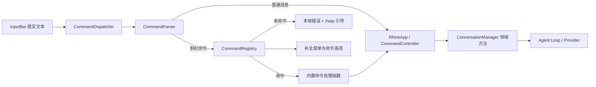

# C10 斜杠命令注册与分发 Plan

> 状态：已批准（2026-07-14，含修订）
> 需求基线：`docs/c10/spec.md`
> 范围：命令注册、解析、分发、补全、输入高亮、模式状态联动与现有命令迁移
> 非目标：用户自定义命令、动态提示词、命令级权限、插件化命令和事件总线

## 1. 设计目标

C10 将现有散落在 `ConversationManager.handle_input`、`CommandPanel.COMMANDS` 和 TUI 提交回调中的斜杠命令逻辑，收敛为一个启动时完成注册、运行时确定性分发的独立命令层。

设计结果需要满足：

- 命令元数据只有一个事实来源，新增命令不再成对维护“逻辑分支 + 补全列表”。
- 斜杠输入在进入 Agent 前被截获；本地命令和界面命令不进入模型历史，也不消耗对话 Token。
- 命令名与别名大小写不敏感，参数原文保持不变。
- 所有名称冲突在启动早期暴露，不能把错误推迟到用户执行命令时。
- 命令层不依赖 Textual，TUI 通过一个窄接口提供显示、对话提交、模式切换和状态刷新能力。
- 当前 11 条命令的行为保持兼容，并新增统一的 `/help`、别名、Tab 补全和命令字段高亮。

## 2. 总体架构

新增 `rhinecode/commands/` 作为独立命令层，由五个职责明确的模块组成：

1. `models.py`：命令元数据、解析结果、分发结果、补全项和控制接口。
2. `parser.py`：只做输入分类与“命令名/参数”切分。
3. `registry.py`：注册、冲突校验、解析名称、补全和帮助文本生成。
4. `dispatcher.py`：在普通消息与命令之间分流，并统一处理回显与错误。
5. `builtins.py`：登记 RhineCode 内置命令及其处理函数。

`RhineApp` 实现框架无关的 `CommandController` 协议；命令处理函数只面向该协议，不导入 Textual。现有 `ConversationManager` 继续负责对话、模式、上下文、会话与记忆等领域能力，但不再解析斜杠文本。



依赖方向固定为：

```text
commands/models
  ↑ parser
  ↑ registry
  ↑ dispatcher / builtins
  ↑ tui/app + tui/widgets
  ↑ __main__

conversation、memory、context、provider 不反向依赖 commands
```

这样可避免命令层与 TUI、Agent 或 Provider 形成循环依赖。

## 3. 启动与生命周期

命令注册表必须在读取配置之后、构造 Provider 和连接 MCP Server 之前建立：

1. 解析启动参数并加载配置。
2. 调用 `build_builtin_registry()` 创建空注册表并批量注册内置命令。
3. 注册过程完成后统一校验规范名和全部别名。
4. 若存在冲突，抛出 `CommandRegistrationError`；入口打印可定位的冲突信息并以退出码 1 结束。
5. 注册成功后再继续构造 Provider、工具、MCP、`ConversationManager` 和 `RhineApp`。
6. 同一个注册表实例同时注入分发器、命令面板和输入高亮器。

提前注册可确保配置错误发生时尚未创建网络连接、MCP 子进程或会话写锁，启动失败更干净。

注册采用原子语义：先在临时映射中验证整批命令，全部通过后再替换正式映射。发生冲突时，不留下“前半批已注册”的半成品状态。

## 4. 核心数据结构

### 4.1 命令类型

```python
class CommandType(Enum):
    LOCAL = "local"
    UI = "ui"
    PROMPT = "prompt"
```

- `LOCAL`：纯本地查询或本地编排，绕过 Agent。包括 `/help`、`/mcp`、`/context`、`/compact`、`/memory`。
- `UI`：改变会话或界面状态，绕过 Agent。包括 `/think`、`/plan`、`/perm`、`/resume`、`/clear`、`/exit`。
- `PROMPT`：把内置预设提示词提交给正常 Agent 路径。当前为 `/init`。

`/compact` 虽可能为摘要调用一次 LLM，但它仍是用户显式触发的本地编排，不作为一条自然语言用户消息交给 Agent。

### 4.2 CommandSpec

```python
@dataclass(frozen=True)
class CommandSpec:
    name: str
    aliases: tuple[str, ...]
    description: str
    usage: str
    command_type: CommandType
    handler: CommandHandler
    argument_hint: str | None = None
    hidden: bool = False
    requires_argument: bool = False
```

约束：

- `name` 和 `aliases` 都保存带 `/` 的完整标识，例如 `/context`、`/ctx`。
- 名称校验和索引键统一使用 `casefold()`，显示时保留定义中的小写形式。
- `usage` 是完整示例，例如 `/resume [编号或ID]`。
- `hidden=True` 时，命令的规范名和全部别名都不出现在帮助、候选菜单和 Tab 补全中，但仍可被直接执行。
- `requires_argument` 为未来有强制参数的内置命令提供统一校验；C10 内置命令均为 `False`。
- `argument_hint` 只用于补全菜单与帮助，不参与解析。

处理函数签名：

```python
CommandHandler = Callable[
    [CommandInvocation, CommandController],
    None,
]
```

处理函数不返回渲染组件或 Agent 事件。耗时工作由控制器复用现有 Worker 消费路径。

### 4.3 输入解析模型

```python
class InputKind(Enum):
    EMPTY = "empty"
    MESSAGE = "message"
    SLASH = "slash"

@dataclass(frozen=True)
class ParsedInput:
    kind: InputKind
    raw_text: str
    command_token: str | None = None
    arguments: str = ""
```

规则：

- 空串或纯空白输入得到 `EMPTY`。
- 去掉输入两端空白后，只有首字符为 `/` 才得到 `SLASH`。
- 第一个空白字符之前是命令字段，之后去掉外层空白后作为参数。
- 不使用 shell 分词，不解析引号，不改变参数内部空白和大小写。
- 命令字段在查询注册表时使用 `casefold()`。

示例：

| 输入 | 类型 | 命令字段 | 参数 |
|---|---|---|---|
| `"   "` | EMPTY | — | — |
| `"解释 /plan"` | MESSAGE | — | — |
| `" /PLAN   Now Please "` | SLASH | `/PLAN` | `Now Please` |
| `"/resume ABC-123"` | SLASH | `/resume` | `ABC-123` |

### 4.4 命令调用与分发结果

```python
@dataclass(frozen=True)
class CommandInvocation:
    raw_text: str
    typed_name: str
    matched_name: str
    arguments: str
    spec: CommandSpec

class DispatchKind(Enum):
    EMPTY = "empty"
    MESSAGE = "message"
    COMMAND = "command"
    UNKNOWN = "unknown"
    ERROR = "error"

@dataclass(frozen=True)
class DispatchResult:
    kind: DispatchKind
    command_name: str | None = None
    message: str | None = None
```

- `typed_name` 保留用户实际输入，例如 `/CTX`。
- `matched_name` 表示实际命中的规范名或别名，例如 `/ctx`。
- `spec.name` 始终是规范名，例如 `/context`。
- `DispatchResult` 用于测试、日志和提交回调的轻量判断，不承载渲染框架对象。

### 4.5 补全项

```python
@dataclass(frozen=True)
class CompletionItem:
    value: str
    canonical_name: str
    description: str
    is_alias: bool
```

别名作为独立候选出现，并明确标注其规范命令。例如输入 `/c` 时可看到（按注册顺序，见第 7 节登记表）：

- `/context` — 查看上下文用量
- `/ctx` — `/context` 的别名
- `/compact` — 手动压缩上下文
- `/continue` — `/resume` 的别名
- `/clear` — 清空当前对话

候选顺序稳定：按命令注册顺序排列；每条命令先规范名、后按声明顺序排列别名。

## 5. CommandController 接口

`commands/models.py` 定义 `Protocol`，命令层只依赖此接口：

```python
class CommandController(Protocol):
    @property
    def tools_enabled(self) -> bool: ...

    def show_user_input(self, text: str) -> None: ...
    def show_message(self, text: str) -> None: ...

    def send_user_message(
        self,
        content: str,
        display_content: str | None = None,
    ) -> None: ...

    def switch_mode(self, target: ModeTarget) -> str: ...
    def query_report(self, target: ReportTarget) -> str: ...
    def refresh_status(self) -> None: ...

    def clear_conversation(self) -> None: ...
    def compact_context(self) -> None: ...
    def resume_session(self, key: str | None) -> None: ...
    def exit_application(self) -> None: ...
```

辅助枚举：

```python
class ModeTarget(Enum):
    THINKING = "thinking"
    PLAN = "plan"
    PERMISSION = "permission"

class ReportTarget(Enum):
    MCP = "mcp"
    CONTEXT = "context"
    MEMORY = "memory"
```

接口语义：

- `show_user_input` 只负责聊天区回显，不写入模型历史。
- `show_message` 显示本地命令结果或错误。
- `send_user_message` 进入现有对话存档、Agent、Worker 和流式渲染路径；它本身不重复回显。
- `switch_mode` 返回供界面显示的结果文本，控制器内部调用对应领域方法。
- `query_report` 返回只读报告。
- `compact_context` 与 `resume_session` 可启动后台事件流，不能阻塞 Textual 主线程。
- `refresh_status` 由影响模式或状态的命令显式调用，不再依赖 TUI 中的命令字符串白名单。

## 6. 注册表设计

`CommandRegistry` 提供：

```python
register(spec: CommandSpec) -> None
register_many(specs: Iterable[CommandSpec]) -> None
resolve(name_or_alias: str) -> CommandSpec | None
complete(prefix: str) -> tuple[CompletionItem, ...]
visible_commands() -> tuple[CommandSpec, ...]
render_help() -> str
```

内部维护：

- 有序的 `CommandSpec` 列表，作为帮助和候选顺序。
- `casefold()` 后的名称到 `CommandSpec` 映射。
- 每个索引键对应的实际规范名或别名，用于构造 `matched_name` 和冲突信息。

冲突检查覆盖：

- 规范名与规范名。
- 规范名与别名。
- 别名与别名。
- 同一条命令内部重复别名。
- 仅大小写不同的重复项，例如 `/Help` 与 `/help`。

错误信息至少包含冲突标识和双方规范命令，例如：

```text
command name collision: /ctx is declared by /context and /other
```

## 7. 内置命令登记

`build_builtin_registry()` 显式构造并返回注册表，不在模块导入时隐式注册，便于测试与启动失败控制。

| 规范名 | 别名 | 类型 | 参数提示 | 行为 |
|---|---|---|---|---|
| `/help` | `/h` | LOCAL | — | 展示可见命令、别名、说明和用法 |
| `/think` | — | UI | — | 循环思考模式 |
| `/plan` | — | UI | — | 切换 Plan Mode 并刷新状态 |
| `/perm` | `/permissions`、`/allowed-tools` | UI | — | 循环权限模式 |
| `/mcp` | — | LOCAL | — | 查看 MCP 状态 |
| `/context` | `/ctx` | LOCAL | — | 查看上下文状态 |
| `/compact` | — | LOCAL | — | 后台执行手动压缩 |
| `/memory` | — | LOCAL | — | 查看记忆状态 |
| `/resume` | `/continue` | UI | `[编号或ID]` | 无参打开选择面板，有参直接恢复 |
| `/init` | — | PROMPT | — | 提交内置项目初始化提示词 |
| `/clear` | `/reset`、`/new` | UI | — | 清空对话并开启新会话档 |
| `/exit` | `/quit` | UI | — | 退出应用 |

所有现有命令保持原行为。C10 的无参命令统一忽略多余参数，例如 `/clear now` 仍执行清空。解析器仍完整保留参数，是否使用由具体处理函数决定。

`/help extra` 同样展示帮助；C10 不增加帮助主题解析。

帮助处理函数通过闭包捕获同一个注册表实例，避免给 `CommandController` 增加只为帮助服务的接口。

## 8. 分发流程

### 8.1 普通消息

以 `解释 /plan 的用途` 为例：

1. 解析器返回 `MESSAGE`。
2. 分发器调用一次 `show_user_input`。
3. 分发器调用 `send_user_message(content=原文)`。
4. `RhineApp` 调用 `ConversationManager.submit_user_message`，并用现有 Worker 消费事件流。
5. 消息照常进入会话存档、上下文管理和 Agent。

### 8.2 本地命令与别名

以 `/CTX` 为例：

1. 解析为命令字段 `/CTX`、空参数。
2. 注册表用 `casefold()` 命中别名 `/ctx`，得到规范命令 `/context`。
3. 分发器只回显一次用户原始输入 `/CTX`。
4. 处理函数调用 `query_report(CONTEXT)`，再调用 `show_message`。
5. 不创建用户 `Message`，不写入模型历史，也不调用 Agent。

### 8.3 界面状态命令

以 `/plan` 为例：

1. 分发器回显原命令。
2. 处理函数调用 `switch_mode(PLAN)`。
3. 控制器通过 `ConversationManager.toggle_plan()` 改变模式。
4. 处理函数显示结果并调用 `refresh_status()`。
5. 状态栏立即从 `[DEFAULT]` 切换为不同颜色的 `[PLAN]`，或反向切回。

### 8.4 预设提示词命令

以 `/init` 为例：

1. 分发器在聊天区回显一次 `/init`。
2. 处理函数取得静态内置初始化提示词。
3. 调用 `send_user_message(content=完整提示词, display_content="/init")`。
4. 模型和会话语义使用完整提示词；当前界面和以后恢复历史时显示 `/init`。
5. 不向聊天区再次显示完整内置提示词，也不重复回显 `/init`。

### 8.5 未知命令

以 `/plna` 为例：

1. 解析器确认它是斜杠输入。
2. 注册表未命中。
3. 分发器回显原输入，并显示本地错误：

```text
未知命令：/plna。输入 /help 查看可用命令。
```

4. 不把 `/plna` 发送给 Agent。

### 8.6 空输入与异常

- 空输入直接得到 `DispatchKind.EMPTY`，不回显、不显示错误、不刷新状态。
- 命令处理函数抛出预期领域异常时，分发器显示简洁本地错误并返回 `ERROR`。
- 命令异常不降级为普通消息，避免把本地错误或意外命令发给模型。
- 调试日志保留异常上下文，但用户界面不输出堆栈。

## 9. ConversationManager 调整

`ConversationManager` 删除集中解析入口 `handle_input`，拆成不依赖命令文本的领域方法：

```python
submit_user_message(
    content: str,
    display_content: str | None = None,
) -> Iterator[AgentEvent]

cycle_thinking() -> str
toggle_plan() -> str
cycle_permission() -> str

mcp_report() -> str
context_report() -> str
memory_report() -> str

manual_compact() -> Iterator[AgentEvent] | str
resume(key: str | None) -> SessionListRequest | Iterator[AgentEvent] | str

clear() -> str

@property
tools_enabled() -> bool
```

具体返回值沿用现有行为，`RhineApp` 通过统一的 `_consume_manager_result` 处理：

- `str`：显示本地结果。
- `SessionListRequest`：打开会话选择面板。
- `Iterator[AgentEvent]`：交给现有 Worker 流式消费。

会话面板选中项目后直接调用控制器的 `resume_session(session_id)`，不再伪造一条隐藏的 `/resume <id>` 输入。这样面板恢复和命令恢复复用同一领域入口，同时不会额外回显用户没有输入的命令。

## 10. TUI 接入

### 10.1 提交入口

`RhineApp.on_input_bar_input_submitted` 只把文本交给 `CommandDispatcher`。不再提前统一追加用户消息，也不再调用 `ConversationManager.handle_input`。

唯一回显规则由分发器控制：

- 普通消息：回显原文一次。
- 命令与别名：回显用户实际输入一次。
- 预设提示词：只显示原始命令，不显示展开后的提示词。
- 空输入：不回显。

现有 `if text in ("/think", ...)` 状态刷新白名单删除，模式命令通过控制器接口显式刷新。

### 10.2 命令菜单

`CommandPanel` 不再维护静态 `COMMANDS` 列表，而是接收注册表候选：

- 输入以 `/` 开头且光标仍位于命令字段时，调用 `registry.complete(prefix)`。
- 隐藏命令及其别名不参与候选。
- 单匹配时，Tab 直接替换命令字段；若命令有参数提示，在命令后保留一个空格供继续输入。
- 多匹配时，Tab 打开或聚焦候选菜单。
- 菜单可见时，方向键移动高亮；Enter 直接执行当前高亮项，即使用户只输入了部分命令。
- Esc 关闭菜单，保留当前输入。
- 已进入参数区时，Tab 不做命令补全，保留 Textual 输入框的正常行为。

示例：

- 输入 `/cont` 后按 Tab：存在 `/context` 与 `/continue` 两个候选，弹出菜单。
- 输入 `/compa` 后按 Tab：只有 `/compact`，直接补成 `/compact`。
- 输入 `/resume 12` 后按 Tab：不改动 `12`。

### 10.3 命令字段高亮

`InputBar` 使用 Textual `Input` 的公开 `highlighter` 扩展点，不覆写私有渲染实现。

高亮规则：

- 只在输入开头的完整命令字段精确命中规范名或别名时着色。
- 命令字段与普通参数使用不同样式。
- 参数和后续空白保持普通输入颜色。
- 未完整命中的前缀不高亮，避免让用户误以为命令有效。
- 大小写形式可命中，但显示仍保留用户输入。

示例：

- `/plan`：`/plan` 整段使用命令色。
- `/PLAN`：`/PLAN` 整段使用命令色。
- `/resume abc`：只高亮 `/resume`，` abc` 保持普通文本。
- `/pla`：不高亮，因为它不是完整命令。
- `解释 /plan`：不高亮，因为命令不在输入开头。

该实现依据 Textual 官方公开接口设计：[Input widget](https://textual.textualize.io/widgets/input/)。

### 10.4 模式状态栏

状态栏保留 Provider、工具、MCP、上下文等现有字段，只替换旧的“计划模式：开/关”文本：

- 默认模式显示 `[DEFAULT]`，使用中性弱化色，例如主题变量 `$text-muted`。
- Plan Mode 显示 `[PLAN]`，使用更醒目的蓝色或青色，例如加粗的 `$text-primary`。
- 状态变化由 `/plan` 处理函数显式调用 `refresh_status()` 后立即反映。
- 使用主题变量而非硬编码 RGB，以适配深色和浅色终端主题。
- Textual markup 中的字面左方括号必须转义，避免 `[DEFAULT]` 或 `[PLAN]` 被当作标签吞掉。

颜色策略参考 Claude Code 用明显模式标记区分默认与计划状态，同时遵循 Textual 的主题变量机制：[Textual design guide](https://textual.textualize.io/guide/design/)。

## 11. 提示词命令的双内容模型

`provider/base.py` 的 `Message` 在末尾增加可选字段：

```python
@dataclass
class Message:
    role: str
    content: str = ""
    tool_calls: Optional[list[ToolCall]] = None
    tool_call_id: Optional[str] = None
    display_content: Optional[str] = None
```

语义：

- `content`：模型实际接收的完整内容，也是语义历史。
- `display_content`：用户界面和历史回放优先显示的原始输入；仅提示词命令需要设置。

`/init` 的 JSONL 用户消息示例：

```json
{
  "role": "user",
  "content": "请分析当前项目并生成或改进项目根 RHINE.md……",
  "display_content": "/init"
}
```

兼容策略：

- `SessionStore` 序列化时仅在字段非空时写入 `display_content`。
- 反序列化旧 JSONL 时缺失该字段，默认 `None`。
- `build_replay_items` 和会话列表标题优先使用 `display_content`，为空时回退 `content`。
- 上下文估算、摘要、Agent Loop 与具体 Provider 始终读取 `content`。
- DeepSeek、OpenAI、Anthropic 的序列化逻辑已显式挑选模型字段，因此无需修改具体 Provider，也不会把 `display_content` 发送给模型 API。
- 本地命令和 UI 命令不创建 `Message`，因此不会出现在 JSONL 模型历史中。

## 12. 模块级设计

### 12.1 `rhinecode/commands/models.py`

- 定义所有命令枚举与不可变数据类。
- 定义 `CommandController` 协议和处理函数类型别名。
- 不依赖注册表、TUI、Conversation、Provider。

### 12.2 `rhinecode/commands/parser.py`

- 提供无副作用的 `parse_input(text)`。
- 只负责空输入、普通输入、斜杠输入分类和一次切分。
- 不查询注册表，不决定未知命令行为。

### 12.3 `rhinecode/commands/registry.py`

- 负责格式校验、原子注册、冲突检测和名称解析。
- 生成稳定顺序的补全项和帮助文本。
- 定义 `CommandRegistrationError`。
- 不执行命令。

### 12.4 `rhinecode/commands/dispatcher.py`

- 组合解析器、注册表和控制器。
- 负责普通消息与命令的入口分流。
- 保证回显恰好一次。
- 统一未知命令、缺少必需参数和处理异常的本地反馈。
- 不持有 Textual widget。

### 12.5 `rhinecode/commands/builtins.py`

- 为 12 条规范命令创建 `CommandSpec`。
- 处理函数尽量只做“参数解释 + 控制器调用”。
- `/help` 处理函数闭包捕获注册表。
- `/init` 的提示词为静态常量，不做运行时动态生成。

### 12.6 `rhinecode/commands/__init__.py`

- 只导出稳定公共接口和 `build_builtin_registry`。
- 不在 import 时创建全局注册表或执行注册副作用。

### 12.7 现有模块

- `conversation.py`：移除命令文本解析，提供领域方法。
- `provider/base.py`：增加 `display_content`。
- `memory/session.py`：JSONL 兼容读写和标题显示。
- `tui/widgets.py`：动态命令面板、Tab 补全、输入高亮、状态标签样式和回放显示。
- `tui/app.py`：实现 `CommandController`，统一消费 Manager 返回值。
- `__main__.py`：启动早期构建注册表、处理注册失败并注入 App。

## 13. 文件组织

### 13.1 新增文件

```text
rhinecode/commands/
├── __init__.py
├── models.py
├── parser.py
├── registry.py
├── dispatcher.py
└── builtins.py

tests/
├── test_command_parser.py
├── test_command_registry.py
├── test_command_dispatcher.py
├── test_command_builtins.py
├── test_command_startup.py
└── test_command_tui.py

docs/c10/
├── spec.md
├── plan.md
├── task.md
└── checklist.md
```

`task.md` 与 `checklist.md` 在后续获批阶段生成，本 Plan 不提前创建。

### 13.2 修改文件

```text
rhinecode/provider/base.py
rhinecode/memory/session.py
rhinecode/tui/widgets.py
rhinecode/tui/app.py
rhinecode/conversation.py
rhinecode/__main__.py

tests/test_memory_session.py
tests/test_resume_replay.py
tests/test_review_fixes.py
tests/test_tui_keybindings.py

README.md
CLAUDE.md
AGENTS.md
```

文档中的旧规则“新增斜杠命令必须成对维护两处”需要更新为：新增一条 `CommandSpec`、实现处理函数并补测试；补全、帮助和高亮都自动读取注册表。

修改 `AGENTS.md` 时必须保留工作区中用户已有的无关改动，只调整与 C10 命令机制直接相关的说明。

### 13.3 明确不修改

- `rhinecode/provider/deepseek.py`
- `rhinecode/provider/openai.py`
- `rhinecode/provider/anthropic.py`
- `rhinecode/agent/loop.py`
- Permission、Context、MCP、Memory 的核心编排实现
- 工具注册和权限判断机制

## 14. 关键技术决策

| 主题 | 决策 | 理由 |
|---|---|---|
| 命令与界面通信 | 直接 `CommandController` 协议 | 当前规模下路径清晰、可测试，不引入事件总线复杂度 |
| 元数据来源 | 单一 `CommandSpec` | 帮助、补全、解析和文档展示共享同一事实来源 |
| 注册时机 | 配置后、Provider/MCP 前 | 冲突尽早失败，避免创建昂贵资源 |
| 启动冲突 | `CommandRegistrationError` → 入口退出码 1 | 达成 fail-fast，错误信息可测试 |
| 标识格式 | 内部保留完整 `/`，比较用 `casefold()` | 显示直观并支持大小写不敏感 |
| 批量注册 | 先验证、后提交 | 避免注册表半成功 |
| 候选顺序 | 注册顺序；规范名在别名前 | 可预测、稳定且便于测试 |
| 参数解析 | 仅按第一个空白切分，不用 `shlex` | 满足命令语义，避免不必要的引号和转义规则 |
| 多余参数 | 传给处理函数；无参命令自行忽略 | 与已确认兼容行为一致 |
| 必需参数 | `requires_argument` + `argument_hint` | 为后续内置命令保留统一验证点 |
| 分层边界 | App 实现控制器；Manager 不导入 commands | 避免领域层依赖 UI 命令概念 |
| 耗时命令 | 保留 `Iterator[AgentEvent]` + Textual Worker | 不引入 asyncio，不阻塞主线程 |
| 分发返回 | 轻量 `DispatchResult` | 便于测试和日志，不复制事件系统 |
| 提示词显示 | `Message.content` + `display_content` | 模型语义与用户界面都保持正确 |
| 会话兼容 | JSONL 可选字段 | 旧存档无需迁移 |
| Provider | 具体 Provider 不改 | 显式字段序列化已天然隔离显示元数据 |
| 回显 | 分发器统一回显原始输入一次 | 避免 App、Handler、Manager 多处重复显示 |
| 补全别名 | 独立候选并标注规范名 | 用户能发现和学习别名 |
| Tab 作用域 | 只拦截开头斜杠命令字段 | 不破坏参数输入与 Textual 默认交互 |
| 输入着色 | 使用公开 `Input.highlighter` | 降低 Textual 升级风险 |
| 模式颜色 | DEFAULT 用弱化主题色，PLAN 用醒目主色 | 清晰区分模式并适配主题 |
| 错误边界 | 本地显示，不降级发送 Agent | 行为确定，防止意外耗 Token |
| 帮助格式 | 纯文本分组输出 | 适配终端宽度，不引入复杂渲染依赖 |
| 测试策略 | 纯逻辑 Fake Controller + Textual `run_test` | 同时覆盖命令层确定性和真实按键交互 |

## 15. 测试计划

### 15.1 解析器

- 空串、纯空白早返回。
- 斜杠不在首位时按普通消息。
- 首空白切分正确，参数两端空白去除、内部内容不改。
- 命令字段大小写保留给 `typed_name`，注册查询大小写不敏感。

### 15.2 注册表

- 规范名、别名均可解析。
- 名称/名称、名称/别名、别名/别名和大小写冲突均失败。
- 批量注册失败后正式注册表不发生部分更新。
- 隐藏命令可执行但不出现在帮助与补全。
- 补全顺序、别名标记和描述稳定。

### 15.3 分发器

- 普通输入只回显一次并提交 Agent。
- 本地、UI、Prompt 三类命令调用正确控制器方法。
- 未知斜杠命令显示 `/help` 引导且不提交 Agent。
- 别名和大小写形式正确分发。
- 空输入无副作用。
- 命令异常转为本地错误，不进入 Agent。
- 无参命令带额外参数仍执行。

### 15.4 内置命令

- 12 条规范命令及确认的别名全部登记。
- 命令类型、描述、用法和参数提示完整。
- `/plan` 等状态命令刷新状态。
- `/resume` 无参打开面板、有参直达恢复。
- `/init` 发送完整提示词并携带 `display_content="/init"`。
- `/help` 不显示隐藏命令，能显示别名和用法。

### 15.5 会话与 Provider 边界

- 新 JSONL 往返保留 `display_content`。
- 旧 JSONL 缺字段仍可载入。
- 历史回放和会话标题优先显示命令原文。
- 模型历史继续使用完整 `content`。
- 三个 Provider 的请求序列化不包含 `display_content`。

### 15.6 TUI

- 输入完整规范命令或别名时仅命令字段着色。
- 部分命令、正文内斜杠不着色。
- 单候选 Tab 直接补全。
- 多候选 Tab 打开菜单。
- 菜单 Enter 执行高亮候选。
- 隐藏命令不进入菜单。
- 参数区 Tab 不触发命令补全。
- `/plan` 切换后状态栏分别显示不同样式的 `[DEFAULT]` 与 `[PLAN]`。
- 字面方括号正确显示，未被 markup 吞掉。

测试优先使用：

- Fake Registry、Fake Controller 验证纯逻辑，不启动真实 Provider。
- Textual `App.run_test()` / Pilot 验证键盘与状态渲染。
- 现有会话、回放、Review 修复和 TUI 静态检查测试做回归更新。

## 16. Spec 覆盖矩阵

| Spec 范围 | Plan 落点 |
|---|---|
| F1–F3 注册中心与启动冲突 | 第 3、4、6、14、15 节 |
| F4–F9 输入解析与分流 | 第 4、8、10、15 节 |
| F10 别名 | 第 4、6、7、10、15 节 |
| F11–F14 参数与用法 | 第 4、7、8、15 节 |
| F15–F18 三种模式与控制接口 | 第 2、4、5、7、8、9 节 |
| F19–F24 帮助、补全、菜单、高亮 | 第 4、6、7、10、15 节 |
| F25–F28 提示词双内容与恢复 | 第 8、11、12、15 节 |
| F29–F31 模式状态栏 | 第 8、10、14、15 节 |
| F32–F33 兼容与回归 | 第 7、12、13、15 节 |
| N1–N12 非功能要求 | 第 2、3、5、6、11、14、15 节 |

经覆盖检查，`spec.md` 中的功能需求、非功能需求和验收方向均有明确设计落点，没有需要在实现阶段临时决定的架构空白。

## 17. 约束与后续边界

C10 不实现：

- 从用户目录或项目目录发现自定义命令。
- 依据上下文动态拼装命令提示词。
- 为单条命令单独配置权限。
- 运行时增删命令或热重载。
- 插件入口点、事件总线或跨进程命令。
- 模糊匹配、拼写自动纠正或自然语言命令路由。
- 恢复会话时自动恢复 Plan/权限/思考模式。

这些能力留给后续 Skill 系统；C10 的 `CommandSpec`、注册表和控制接口只提供稳定基础，不预先引入其复杂度。

## 18. 进入任务拆分的条件

只有本 Plan 经用户整份批准后，才生成 `docs/c10/task.md`。任务拆分应按可验证的垂直顺序安排：

1. 命令模型、解析器与注册表。
2. 分发器与内置命令。
3. ConversationManager 领域方法拆分。
4. TUI 控制器、补全、高亮和状态栏。
5. 双内容会话持久化与恢复。
6. 启动接线、文档同步和完整回归。

在 `task.md` 与 `checklist.md` 均批准前，不进入实现阶段。
