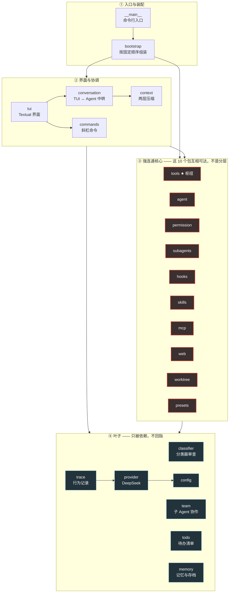
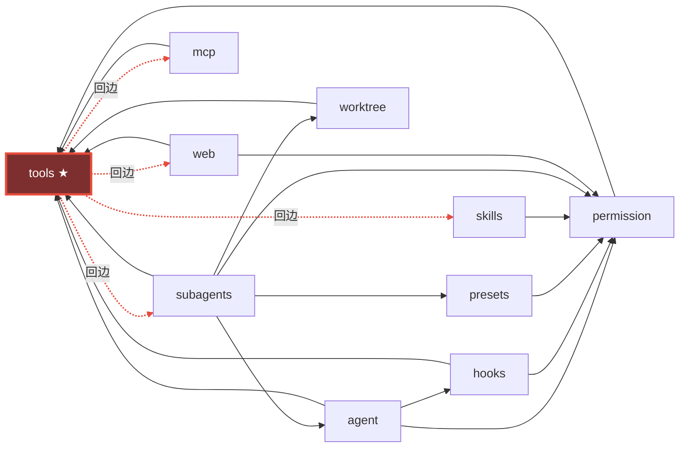

# 阶段 5 · 可维护性与交付物（R6）

> 2026-08-30。**本轮只产出草案与建议，不往仓库根安装任何东西**——配置文件一律
> 作为代码块附在本文里，装不装由用户定。
>
> 本文里凡是带数字的地方**都是本轮现测的**，不是抄 `00-baseline.md`。
> 那份基线量于 2026-08-22，之后 F1（机械清理）/ F2 / F3 / F4（CI）四批改动
> 都动过代码，**它的 ruff 数字已经不能直接用了**——第 0 节逐条说明差在哪。
>
> ⚠ **本文与 R6 原始计划有一处偏差**：第 1 项「GitHub Actions 配置草案」
> **已经在 F4 里落地了**（PR #58，`.github/workflows/ci.yml`）。R6 排在 F4 之前，
> 但实际执行顺序反了过来。因此第 1 节**不再写草案**，改成「拿 R6 的要求
> 逐条核对已落地的那份 + 指出缺口」——再写一份草案只会多一份会漂移的文档。

## 本轮实测环境

| 项 | 值 |
| --- | --- |
| Python | 3.11.9 / Windows 11 |
| ruff | 0.8.4 |
| mypy | 2.3.1 |
| 全量测试 | **3,349 / 3,349 全绿**，8 分片并行 **38.4s** |
| 源文件 | 172 个（`rhinecode/`） |

⚠ **测试条数三处对不上**：`CLAUDE.md` 写 3,323、F4 的验收记录写 3,348、
本轮实测 **3,349**。这是 R7（文档漂移）的典型样本，不在本轮修——
但**下面凡引用条数的地方一律用 3,349**。

---

## 0. 三处对 `00-baseline.md` 的更正

**先读这一节。** 不读的话，下面所有「为什么这么配」的理由都会显得没头没尾。

### 0.1 ⚠ 基线里 ruff 的两张表**不是同一个作用域**，不能横向比较

`00-baseline.md` 第 3 节有两张表：「默认规则集」与「高信号规则组」。
本轮把两个作用域都跑了一遍，对上了：

| 规则组 | 基线记的数 | `rhinecode` only | `rhinecode tests` |
| --- | --- | --- | --- |
| B (bugbear) | 2 | **2** ✅ | 11 |
| C4 | 1 | **1** ✅ | 17 |
| PERF | 24 | **24** ✅ | 41 |
| RUF012 | 35 | **35** ✅ | 83 |
| RUF100 | 77 | **77** ✅ | 141 |
| S110 | 50 | **50** ✅ | 57 |

**「高信号规则组」那张表量的是 `rhinecode` 一个目录，「默认规则集」那张量的是
`rhinecode tests` 两个。** 而「怎么复现」那一节只给了一条带 `tests` 的命令。
后果很具体：R6 的原始 Prompt 据此写下「建议 E/F/B，总共只有 78 个问题」，
那个 78 是 `76（默认集，含 tests）+ 2（B，不含 tests）`——**两个作用域的数相加**。

⚠ **这不是记错了一个数，是两张表的口径没写出来。** 本文所有 ruff 数字
一律标注作用域。

### 0.2 F1 清掉了四类，但**两个真 bug 一条都没修**

F1 跑的是 `--select F401,F841,F541,C4 --fix`。默认规则集因此从 76 掉到 20：

| 规则 | 基线（含 tests） | 现在（含 tests） |
| --- | --- | --- |
| F401 unused-import | 45 | **0** |
| F541 f-string-missing-placeholders | 6 | **0** |
| F841 unused-variable | 5 | **0** |
| E741 ambiguous-variable-name | 16 | 16 |
| E402 module-import-not-at-top | 3 | 3 |
| **F821 undefined-name** | **1** | **1** |

⚠ **顺带一个小证据：一次性 `--fix` 不带门禁就会回潮。** F1 当时把 `C4` 也
一并 `--fix` 清成了 0，而今天 `rhinecode/` 下又有一条
（`tui/app.py:932` 的 `C408 Unnecessary dict() call`）——是 F2~F4 那几批改动
新写进去的。**这正是「装一次检查器」与「装一个门禁」的差别**：前者只在
运行的那一刻成立。

**基线点名的两个真问题今天原样都在：**

```
rhinecode\conversation.py:1736:30: F821 Undefined name `AskFn`
rhinecode\config.py:347:9: B904 Within an `except` clause, raise exceptions with `raise ... from err`
```

（`AskFn` 那处行号从 1727 漂到 1736，是中间几批改动挪的，不是另一处。）

这件事对本文第 2 节有直接影响：**按下面推荐的配置装上 ruff，CI 第一次跑就是红的。**
那是对的——它红在两个真 bug 上，不是红在噪声上。但**顺序必须是「先修这两条、
再装 lint 门禁」**，否则第一天就得开一个 `# noqa` 的口子，而那个口子不会再关上。

### 0.3 ⚠ ruff 0.8.4 **不从 `requires-python` 推断 `target-version`**

这条基线没提，但它会让「照基线的数配好，装上之后数字对不上」。实测：

```bash
$ ruff check rhinecode tests --select B905                 # 仓库根，pyproject 里有 requires-python = ">=3.11"
All checks passed!
$ ruff check rhinecode tests --select B905 --target-version py311
Found 4 errors.
```

没有 `[tool.ruff]` 段时 ruff 0.8.4 按 **py38** 处理，于是所有「这个语法要 3.10+ 才有」
的规则（B905 `zip(strict=)` 是典型）**整条不触发**。基线的全部 ruff 数字都是在
这个隐式 py38 下量的。

**所以推荐配置里 `target-version = "py311"` 不是抄模板，它会实打实多报 4 条。**

### 0.4 强连通分量是 **10 个还是 11 个，取决于两个口径**

基线第 5 节报「10 个包在同一个强连通分量」，列的是
`agent ↔ context ↔ hooks ↔ mcp ↔ permission ↔ skills ↔ subagents ↔ tools ↔ web ↔ worktree`。

本轮重跑 AST 全量扫描（172 个文件），结论要拆成两个：

| 口径 | 分量大小 | 成员 |
| --- | --- | --- |
| **算上顶层 .py 模块 + 算上 TYPE_CHECKING 里的 import** | **11** | 基线那 10 个 **+ `presets`** |
| **只算运行期真的会执行的模块级 import** | **10** | 基线那 10 个 **－ `context` ＋ `presets`** |

两处差异各有一个具体原因，都值得写进架构图：

**① `presets` 没被基线算成节点。** 基线扫的是「跨**子包** import」，而
`presets.py` 是顶层模块不是包。它确实在环里：
`subagents → presets → permission → tools → subagents`。

**② `agent → context` 这条边是 `TYPE_CHECKING` 专有的**，运行期不存在：

```python
# rhinecode/agent/loop.py:32
if TYPE_CHECKING:
    # 仅类型检查期导入，运行期用字符串注解——避免与 context 层产生任何潜在导入顺序问题。
    from rhinecode.context import ContextManager
```

**注释写明了这是刻意的。** 也就是说 `context` 之所以出现在基线那个环里，
恰恰是因为作者为了不进环而做的那件事被扫描器算成了一条边。全项目
**只有这一条**跨包边是纯 TYPE_CHECKING（另有 `team → provider` 一条是函数体内
的延迟 import）。

⚠ **本文第 5 节的架构图按「运行期模块级 import」那个口径画**，并把这两条
特殊边单独标出来——它们是这张图上信息量最大的两条。

---

## 1. GitHub Actions —— ⚠ 已落地，本节是核对与补缺

`.github/workflows/ci.yml` 已在 F4（PR #58）装上并跑绿。**不再另出草案。**

### 1.1 R6 的五条要求 vs 现状

| R6 要求 | 现状 | 位置 |
| --- | --- | --- |
| 矩阵 `{windows, ubuntu} × {3.11, 3.12, 3.13}` | ✅ 一字不差 | `test` job 的 `strategy.matrix` |
| 跑 `python -m tests.run_parallel` | ✅ | `test` job 最后一步 |
| 干净安装验证（`pip install .` 后 `rhine --help`） | ✅ **独立成一个 job** | `install` job |
| 坑①：runner 上必须有 git | ✅ 显式一步 `git --version` | `test` job 第三步 |
| 坑②：`TEMP/TMP/TMPDIR` 分片隔离在 CI 上成不成立 | ✅ 已确认成立，理由写在注释里 | `test` job 最后一步的注释 |

### 1.2 那两个坑各自是怎么处理的（这两处值得记住）

**坑①「缺 git 是硬失败不是跳过」——处理成了一个必然通过的步骤。**
GitHub 托管 runner 两个平台都预装 git，所以 `git --version` 正常情况下一定过。
留着它不是仪式：**它把失败信息从「散落在十几条用例里的各种 git 报错」
变成「这一行明确的找不到 git」**。这是「前置条件显式化」的标准做法。

**坑②的答案是：这套隔离不依赖 CI 环境，因为它不读环境变量、它写环境变量。**
本轮核对了 `tests/run_parallel.py`：

```python
# tests/run_parallel.py:192-194
td = tempfile.mkdtemp(prefix=f"rhine_shard{i}_")
env = dict(os.environ, TEMP=td, TMP=td, TMPDIR=td, PYTHONIOENCODING="utf-8")
```

它**自己 `mkdtemp` 之后给子进程设这三个变量**，而不是读 runner 上已有的值。
成立的唯一前提是「系统临时目录可写」，两个平台都满足。

⚠ **值得记一笔的是这个坑的方向**：R6 的原始 Prompt 写的是「靠 TEMP/TMP/TMPDIR
环境变量……要确认这套隔离在 CI 里仍然成立」，很容易读成「它依赖环境预先设好什么」，
于是去 workflow 里配几个环境变量。**实际是反过来的：它写这三个变量，不读。**
所以答案是「天然成立，什么都不用配」——而这个答案只有把 `run_parallel.py`
翻开看一眼才拿得到，光看 Prompt 会配出一堆没用的东西。

另外那份 workflow 还处理了**一个 R6 没预见到的坑**，值得记：

```yaml
env:
  PYTHONUTF8: "1"
```

CI 里 stdout 是管道不是控制台，Windows runner 的 locale 是 cp1252，
**第一句中文就 `UnicodeEncodeError`**，而报出来的栈跟测试内容毫无关系。
`run_parallel` 给子进程设了 `PYTHONIOENCODING`，但管不到自己这个父进程、
也管不到 `rhine --help`，所以要在 workflow 级别统一设一次。

### 1.3 三处缺口与建议（有依赖顺序）

#### 缺口 A 🟠 没有 lint / 类型检查这一格 —— **但它现在还不能装**

本文第 2、3 节的产出正是为了填这一格。**但顺序有硬依赖**：
按推荐配置今天装上，CI 第一次跑就红在 §0.2 那两个真 bug 上。

**推荐顺序**：修 F821 与 B904（十分钟的事）→ 再加 `lint` job。
反过来做的话，第一天就要在 CI 里加 `continue-on-error: true` 或在代码里
撒 `# noqa`，而**那两样东西装上之后都不会再被摘掉**。

装上之后的 job 长这样（**它依赖第 2、3 节的配置块先进 `pyproject.toml`**）：

```yaml
  lint:
    name: 静态检查
    runs-on: ubuntu-latest
    timeout-minutes: 10
    steps:
      - uses: actions/checkout@v4
      - uses: actions/setup-python@v5
        with:
          python-version: "3.12"

      # ⚠ 版本必须钉死。ruff 迭代很快，新版本会**新增规则**——不钉的话
      #   某天 CI 会因为「ruff 升级了」而红，而那一天的 diff 里什么都没有，
      #   排查成本极高。升 ruff 应该是一次显式的、单独的提交。
      - name: 安装检查工具
        run: python -m pip install "ruff==0.8.4" "mypy==2.3.1"

      # 项目自身与依赖都要装上，否则 mypy 只能靠 --ignore-missing-imports
      # 蒙混过去，textual / openai 的类型信息一条都用不上。
      - name: 安装项目
        run: python -m pip install -e .

      # 配置全部在 pyproject.toml 的 [tool.ruff] 里，这里不带任何 --select，
      # 保证「本机跑的」与「CI 跑的」是同一套规则。
      - name: ruff
        run: ruff check rhinecode tests

      - name: mypy
        run: mypy rhinecode
```

**成本**：约 1 分钟一格，且只跑一格（lint 与操作系统、Python 版本无关，
铺矩阵是浪费机器时间）。本机实测两个工具本身都很便宜——
**ruff 全量 0.05 秒，mypy 冷缓存 8.9 秒**，这一格的时间几乎全花在
`pip install` 上。

#### 缺口 B 🟡 覆盖率不在 CI 上，91% 这个数字**没有任何东西盯着它**

现状是「审查时手工量过一次」。开源之后别人提 PR，覆盖率掉了没有任何信号。

**但不建议现在就上 codecov 那一套**，理由是这个项目的覆盖率有一个已知的
结构性问题（基线第 2 节写得很清楚）：**620 条测试真起子进程，子进程里执行的
产品代码 coverage 默认抓不到**。直接挂一个 `fail_under=91` 的门禁，会在
「某个测试从进程内改成起子进程」时莫名其妙地红，而那不是回归。

**建议的低成本做法**：先只**记录**不**门禁**——在 `test` job 的 ubuntu/3.12
那一格额外跑一次带覆盖率的串行测试，把报告作为 artifact 传上去。
需要时能翻，但不会误伤。真要上门禁，前置是先解决子进程覆盖率
（`coverage` 的 `--parallel-mode` + `combine`，属独立改动）。

#### 缺口 C 🟢 三件小事，价值递减

| 项 | 判断 |
| --- | --- |
| **macOS 未进矩阵** | 项目自称主力平台是 Windows，Linux 已由 CI 覆盖。macOS 与 Linux 同为 POSIX，边际信息量小。**建议不加**——6 格已经要跑几分钟，加到 9 格换不来相应的信息 |
| **依赖未缓存** | `actions/setup-python` 的 `cache: pip` 就能开，省下每格约 20~30 秒。**值得加**，零风险。⚠ 本项目没有 `requirements.txt`，依赖只写在 `pyproject.toml` 里，所以要同时给 `cache-dependency-path: pyproject.toml`——不给的话它找不到依赖清单、算不出缓存键 |
| **`pip` 未固定版本** | 与 lint job 里钉死 ruff 同一条理由，但优先级低得多——pip 的破坏性变化比 ruff 少一个量级 |

---

## 2. ruff 落地方案

**总原则：保守。** 一次开满会产出几千条告警，然后没人看——而一个没人看的
检查器比没有检查器更糟，它会让人养成「红了也无所谓」的习惯，等到某天它报了
一条真问题时，那条也会被一起划走。

下面三步，**每一步的产出条数都是本轮实测的**，不是估的。

### 2.1 先纠正一个前提：那三万条**默认根本不会触发**

R6 的原始 Prompt 与 `00-baseline.md` 都写着「必须先禁用 RUF001/002/003
否则工具完全不可用」。实测下来这句话要改一个字：

**`RUF001/002/003` 属于 `RUF` 规则组，而 ruff 的默认 `select` 是 `E4,E7,E9,F`
——不主动写 `select = ["RUF"]` 就一条都不会报。** 基线那 29,867 条是
`--select RUF` 手工跑出来的（本轮复量为 3,020 + 18,997 + 8,110 = **30,127**，
差值是这几天新增的中文注释）。

**所以它不是「上 ruff 的前置障碍」，而是「一条永远不能碰的红线」。**
差别在于该怎么处理：

- ❌ 不必为了上 ruff 先做什么
- ✅ **但必须显式写进 `ignore`**——因为将来任何人（包括未来的你）
  加一句 `select = ["ALL"]` 或 `select = ["RUF"]`，都会在那一秒炸出三万条告警，
  然后大概率的反应是「ruff 对这个项目没用」，把整个配置删掉。
  **写进 `ignore` 的成本是三行，挡的是整个工具被放弃。**

⚠ 这三条规则与中文项目的不兼容是**规则本身的问题，不是项目的问题**：
它们把全角标点判定为「与 ASCII 标点视觉相似、可能是同形字攻击」，
而本项目**强制要求中文注释**。这两件事永远无法同时满足。

### 2.2 第一步（建议现在就做）：`E4 / E7 / E9 / F / B`

**实测产出：7 条，全在 `rhinecode/` 下。**

```
rhinecode\agent\loop.py:1016:33     B008  函数调用作默认参数           ← 误报，见下
rhinecode\config.py:347:9           B904  except 里 raise 丢了异常链   ← 🔴 真 bug
rhinecode\conversation.py:1736:30   F821  未定义名字 AskFn            ← 🔴 真 bug
rhinecode\skills\render.py:196:69   B905  zip() 没写 strict=          ← 🟡 值得修
rhinecode\tui\app.py:81,89,90       E402  import 不在文件顶部（3 条）  ← 🟢 三十秒的事
```

**七条里两条是基线早就点名的真 bug，四条是十分钟能清干净的，一条是误报。**
这就是「保守起步」应该长的样子：装上之后的第一次红，每一条都值得看。

逐条处置建议：

| 位置 | 规则 | 处置 | 理由 |
| --- | --- | --- | --- |
| `config.py:347` | B904 | **修** | 同一个 `try` 的下一个分支（`:349`）就写了 `from e`，这是笔误。后果是原始异常的 traceback 丢失——配置读不出来时用户看到的是「配置文件不存在」，而不是真实的 OS 错误 |
| `conversation.py:1736` | F821 | **修** | `def _build_ask(self) -> "AskFn"`，而 `AskFn` 定义在 `agent/loop.py`、本文件从未导入它。字符串注解运行期不求值所以不崩，但 `typing.get_type_hints()` 会 `NameError`。mypy 用完全不同的机制独立报了同一行（`[name-defined]`），**两个工具指向同一处，可信度很高** |
| `skills/render.py:196` | B905 | **修**（加 `strict=True`） | `zip(items, flags)`，而 `flags = [True] * len(items)`——**今天长度必然相等**。正因如此加 `strict=True` 零风险，而它把一条隐含不变量变成了会当场爆炸的断言。这条完全贴合本项目的护栏哲学：不加的话，将来哪次改动让 `flags` 短了一位，`zip` 会**静默截断**，表现为「清单少了最后一行」——又一个「漏改一律不报错」 |
| `tui/app.py:81,89,90` | E402 | **修**（挪位置） | 本轮看过现场：`LEVEL_*` 三个常量和 `_NOTIFY_KINDS` 被插进了 import 块中间，于是三个 import 掉到了常量后面。**不是刻意的延迟 import**，纯属编辑意外。把那三个 import 挪到常量之前即可，零行为变化 |
| `agent/loop.py:1016` | B008 | **不修，写一行 `# noqa: B008` 并注明理由** | 基线已确认是误报：`RunOptions` 是 `@dataclass(frozen=True)` 且字段用 `frozenset()` 而非 `set()`。⚠ **不要为它开 per-file-ignore，更不要把 B008 整条关掉**——那会连带放过将来真出现的可变默认参数。一行 `noqa` 精确到这一处，且下次有人读到时能看见理由 |

**`tests/` 侧为什么整组豁免？** 同一套规则在 `tests/` 下另外报 **28 条**
= 16 条 E741 + 12 条 B（B023 4 / B905 3 / B008 2 / B017 2 / B007 1）。
逐条看下来，全部是「规则在测试语境下不适用」：

- **E741 那 16 条全是 `l`**，且全是 `[l for l in lines]` 这种「l = line」的
  推导式，在测试里是无歧义的惯用写法。⚠ 顺带一提，**E741 在 `rhinecode/`
  下一条都没有**——产品代码里没人这么写。
- **B023 那 4 条**（`test_team_board.py:270-273`）是在 `for _ in range(10)` 里
  给线程定义闭包。看着像经典的闭包捕获陷阱，**实际不是**——那个循环在进入
  下一轮之前 `join` 了全部线程，变量重绑定发生在所有闭包都跑完之后。
- **B905 那 3 条**与产品侧那条同源，但测试里 `zip` 的两个入参往往是同一次
  构造出来的，加 `strict=` 只是噪声。
- **B008 那 2 条**与 `agent/loop.py:1016` 同源（frozen dataclass 作默认值）。
- **B017 那 2 条**（`assertRaises(Exception)`）用在「一定会抛、且不关心抛的是
  哪个」的场景下，是合理的。
- **B007 那 1 条**是解包时用不上其中一个变量。

即：**这不是「测试代码可以随便写」，是这几条规则在测试语境下确实不适用。**
产品代码那一侧**一条都没豁免**——`agent/loop.py:1016` 那个同类误报走的是
单行 `# noqa`，不是 per-file-ignore。

### 2.3 第二步（第一步稳定运行一两周后）：加 `BLE` + `RUF100`

这两条**必须一起加**，而且它们的价值远超字面。

**先看一个反常的数字**：`RUF100`（写了但用不上的 `# noqa`）在 `rhinecode tests`
上有 **141 条**。一个从未跑过 ruff 的项目，为什么会有 141 个多余的 `noqa`？
本轮拆开看了：

| `noqa` 引用的规则 | 条数 | 这条规则被 select 了吗 |
| --- | --- | --- |
| `BLE001` blind-except | 93 | ❌ |
| `ARG002` unused-method-argument | 18 | ❌ |
| `SLF001` private-member-access | 11 | ❌ |
| `ARG001` | 6 | ❌ |
| `A002` / `N805` / `F401` / `E731` / `D401` / `ANN001` | 各 1~4 | ❌ |

**这 141 条不是技术债，是一份没人认领的资产。** 作者一直在按 ruff 的规则码
标注「这里的宽泛 except 是刻意的」「这个参数没用是接口要求的」——**只是从来
没有哪个工具去读它**。`RUF100` 报的不是「你写多了」，是「你标的这些我一条都没在查」。

于是：

```
启用 BLE 之后，rhinecode/ 下还剩 44 条 BLE001 —— 那是**没有被标注**的宽泛 except。
```

**这 44 条正是 R4（`02-robustness.md`）那一整轮在人工找的东西。** R4 靠人读出
67 处异常吞噬；`BLE` 能把「哪些是刻意的（有 noqa）、哪些是随手写的（没 noqa）」
**机械地分开**，而且从此每个新 PR 都自动分一次。

**⚠ 但直接开 `RUF100` 会立刻报 141 条假警报**（它们标的是没启用的规则）。
解法是 ruff 的 `external` 设置——**本轮实测有效**：

```toml
external = ["ARG001", "ARG002", "SLF001", "A002", "N805", "D401", "ANN001", "E731"]
```

加上之后 `RUF100` 从 141 掉到 **27**，而这 27 条是**真的**：它们标的是 `BLE001`，
可那几处的 `except` 后面跟的是 `raise ... from exc`（重新抛出，不是吞掉），
`BLE001` 本来就不该触发。举两个：

```
rhinecode\mcp\auto_config.py:445    # noqa: BLE001  →  下一行是 raise ValueError(...) from exc
rhinecode\permission\config.py:357  # noqa: BLE001  →  下一行是 raise ValueError(...) from exc
```

**这 27 处是「作者以为自己在吞异常，其实没有」**——对一个刚做完 R4 异常审查的
项目来说，这条信息本身就值这一步。

**第二步实测总产出：44（BLE001）+ 27（RUF100）+ 7（第一步剩下的）= 78 条。**
（⚠ 这个 78 与 §0.1 里题面那个「78 个问题」**只是数字巧合**，不是同一批东西。）
⚠ 78 条一次摆出来偏多，所以**它必须排在第一步之后**：第一步那 7 条清完再开，
看到的就是纯粹的 71 条新信息。

### 2.4 第三步：明确**永远不开**的（写下来，免得下次有人试）

| 规则组 | 本轮实测（`rhinecode tests`） | 为什么不开 |
| --- | --- | --- |
| `RUF001/002/003` | **30,127** | 中文标点。见 §2.1 |
| `D`（pydocstyle） | **15,121** | 本项目有自己的一套中文 docstring 规范（`CLAUDE.md`「代码注释规范」），要求写明输入来源、执行步骤、副作用。`D` 查的是英文 docstring 的格式惯例（首行祈使句、句号结尾），**两套规范互不兼容，而本项目这套要求更高** |
| `ANN`（类型注解） | 2,226 | 项目注解覆盖率已约 87%，剩下的靠 mypy 管更合适。`ANN` 问「有没有写」，mypy 问「写得对不对」，后者信息量大得多 |
| `ARG` / `SLF` | 467 / 307 | 数量级不对。**且注意**：作者已为其中 35 处写过 `noqa`（见上表），说明剩下的四百多处多半也各有理由。真要开，得先做一轮人工分类，成本远高于收益 |
| `E501` line-too-long | 1,455 | 中文字符宽度与 ruff 的列计数不匹配，且本项目的注释本来就长。**这一条要显式 `ignore`**——它在 `E5` 组里，将来有人把 `select` 从 `E4,E7,E9` 改成 `E` 就会全冒出来 |
| `SIM105` | 63 | 它建议把 `try/except: pass` 换成 `contextlib.suppress`。而本项目的 `try/except: pass` 大多是**刻意的 fail-safe**（S110 那 50 条与之吻合），换写法既不解决问题，还会让 R4 那类审查更难 grep |
| `PERF401` | 23 | 全在非热点路径，基线已确认 |
| `RUF012` | 83 | 基线抽查确认全部误报：工具的 `parameters` JSON schema 常量、Textual 框架约定的 `BINDINGS`、查表常量。它们该标 `ClassVar` 但不标也完全正确 |

### 2.5 完整配置块（贴进 `pyproject.toml` 末尾）

```toml
# ─────────────────────────────────────────────────────────────────────────
# ruff 配置（审查项 R6）
#
# 总原则：**保守**。一个没人看的检查器比没有检查器更糟——它会让人养成
# 「红了也无所谓」的习惯，等到某天它报出一条真问题，那条也会被一起划走。
# 所以这里只开「报出来的每一条都值得看」的规则。
#
# ⚠ 装上之前先修掉 config.py:347 (B904) 与 conversation.py:1736 (F821) 两个
#   真 bug，否则 CI 第一次跑就是红的；而第一天开的口子（continue-on-error
#   或撒 noqa）之后不会再被摘掉。
# ─────────────────────────────────────────────────────────────────────────
[tool.ruff]
# ⚠ 这一行不是抄模板。ruff 0.8.4 **不从 requires-python 推断 target-version**，
#   没有它就按 py38 处理，于是所有「要 3.10+ 才有的语法」相关规则整条不触发
#   （B905 `zip(strict=)` 是典型：不写这行报 0 条，写了报 4 条）。
target-version = "py311"

# 只影响格式化器。E501 没有 select，这个值不产生任何检查行为。
line-length = 100

[tool.ruff.lint]
# 第一步只开这五组：E4=import 相关，E7=语句风格，E9=语法错误，
# F=pyflakes，B=bugbear（真能抓 bug 的那一组）。
#
# 第二步（跑稳一两周后）把下面两条加进来，理由见 docs/review/05-maintainability.md：
#   "BLE",      # 宽泛 except。项目里已有 93 处写了 # noqa: BLE001，开了才有意义
#   "RUF100",   # 与 BLE 成对，必须同时开，且需要下面那段 external
select = ["E4", "E7", "E9", "F", "B"]

ignore = [
    # ⚠ **这三条是红线，永远不要删。**
    #
    # RUF001/002/003 (ambiguous-unicode) 把全角标点判定为「与 ASCII 视觉相似、
    # 可能是同形字攻击」，而本项目**强制中文注释**——两件事永远无法同时满足。
    # 实测触发 30,127 条。
    #
    # 它们不在默认 select 里，所以今天写不写都不影响结果。写在这里是**防御性的**：
    # 将来任何人加一句 select = ["ALL"] 或 ["RUF"]，都会在那一秒炸出三万条，
    # 然后大概率把整个 [tool.ruff] 删掉。三行挡的是整个工具被放弃。
    "RUF001",
    "RUF002",
    "RUF003",

    # 同样是防御性的：E501 在 E5 组里，把 select 从 "E4","E7","E9" 改成 "E"
    # 就会冒出 1,455 条。中文字符宽度与 ruff 的列计数不匹配。
    "E501",
]

# 第二步启用 RUF100 时**必须同时**加上这一段，否则会报 141 条假警报。
#
# 背景：作者一直在按 ruff 的规则码写 # noqa（BLE001 93 处、ARG002 18 处、
# SLF001 11 处…），但那些规则从没被 select 过，于是 RUF100 会说「这些 noqa 没用」。
# external 告诉 ruff「这些码由别的东西负责」，它便不再对它们报 RUF100。
# 实测：加上之后 RUF100 从 141 掉到 27，而剩下那 27 条是真的（标了 BLE001，
# 但那几处的 except 后面跟的是 raise ... from exc，本来就不该触发）。
#
# external = ["ARG001", "ARG002", "SLF001", "A002", "N805", "D401", "ANN001", "E731"]

[tool.ruff.lint.per-file-ignores]
# ⚠ **产品代码一条都没豁免**，这里全部是「规则在测试语境下确实不适用」。
# 逐条核对过：这 28 条违规**全部**落在 tests/ 下。
#
#   E741  16 条，全是 [l for l in lines] 这种「l = line」，测试里无歧义
#   B023   4 条，for 循环里给线程定义闭包——但循环在进入下一轮前 join 了
#          全部线程，变量重绑定发生在所有闭包跑完之后，是**误报**
#   B017   2 条，assertRaises(Exception)：验「一定会抛、不关心抛哪个」
#   B008   2 条，与 loop.py 那处同源（frozen dataclass 作默认值）
#   B007   1 条 / B905  3 条
#
# ⚠ 别把这些规则整条关掉，也别给 rhinecode/ 开同样的豁免——
#   agent/loop.py:1016 那一处 B008 误报请用**单行 noqa** 精确处理，
#   那样下次有人读到时还能看见理由。
"tests/**" = ["E741", "B007", "B008", "B017", "B023", "B905"]
```

---

## 3. mypy 落地方案

本轮复量：**109 个错误 / 19 个文件（共检查 172 个源文件）**，与基线一字不差。

### 3.1 ⚠ 那 16 个 `union-attr`：**逐条看过了，没有一个是今天的真 bug**

这一节推翻基线 3b 节的判断。基线写的是：

> **union-attr 16 —— Optional 未判空就取属性，最可能是真 AttributeError**

**「最可能」这个词是猜的，本轮把 16 处全部打开看了。** 结论是：
**16 处全部是「判空发生在别处、mypy 看不见」，没有一处能在今天走到 None。**

分布高度集中：

| 位置 | 条数 | 形态 |
| --- | --- | --- |
| `tui/widgets.py:3781~3885` | **11** | 同一个类的 `self._question: Optional[ClarifyQuestion]` |
| `agent/loop.py:1803, 1992` | 2 | `self._registry` / `tc.arguments` |
| `conversation.py:889, 1155` | 2 | `self._context_manager` / `spec` |
| `tools/send_message.py:178` | 1 | `result.envelope` |

**那 11 条是同一个变量。** `ClarifyPanel._question` 初值为 `None`，由
`show_question()` 赋值；此后的 11 个渲染方法直接取属性。面板不可能在
`show_question` 之前被渲染——**是生命周期保证的，不是判空保证的**，
而 mypy 看不见生命周期。顺带一提，同一个类里 `_submit_position()`（`:3796`）
**写了** `if question is None` 的判空，所以这不是「作者不知道要判空」，
是「作者知道哪几处需要、哪几处不需要」。

另外 5 条是同一种形态的不同变体，最典型的是 `conversation.py:889`：

```python
# :848  公开入口 —— 判空在这里
def manual_compact(self):
    if not self._tools_enabled or self._context_manager is None:
        return "当前 Provider 不支持上下文管理"
    return self._manual_compact()

# :889  私有实现 —— mypy 在这里报错
def _manual_compact(self):
    notice = self._context_manager.manual_compact(self.history)   # ← union-attr
```

**判空在公开入口，报错在私有实现，中间隔了一层方法边界。**
另外三处的守卫位置本轮也逐个找到了，都可核对：

| 报错处 | 守卫在哪 | 形态 |
| --- | --- | --- |
| `agent/loop.py:1992` `tc.arguments.get(...)` | `_run_special`（`:1900`）的 `if not isinstance(tc.arguments, dict): return` | 调用方一层之上 |
| `agent/loop.py:1803` `self._registry.get(...)` | `plan_blocked` 只可能在有注册中心时非空（`:1441` 的 `if self._registry else None`） | 数据来源保证 |
| `tools/send_message.py:178` `result.envelope.summary` | 同函数 `:167` 的 `if not result.ok: return` | 契约保证（`ok` 为真时 `envelope` 必非空） |

⚠ **`loop.py:1992` 那一处值得单独说一句**，因为它是四处里唯一「**真的可能**
拿到 `None`」的：`ToolCall.arguments` 的 docstring 明写「模型生成的 JSON 非法
导致解析失败时为 `None`」，而 `ask_user` / `present_plan` 在 `:1437` 就被从
主分流里摘走了，**不走普通工具那条「参数解析失败」的分支**。
守住它的是 `_run_special` 开头那句 `isinstance` ——**这一句删掉就是一个真
`AttributeError`**。mypy 看不见它，但它确实在。

**所以这 16 条不该排在前面清。** 它们的真实价值不是「修 bug」，是
**「把只存在于作者脑子里的不变量写成代码」**——而那正是这个项目通篇在做的事。
真要清，正确的修法不是加 `if x is None: return`（那会引入一条永不执行的分支，
测试也覆盖不到），而是 `assert x is not None, "调用前必须先 show_question"`：
断言同时喂饱了 mypy 和读代码的人，且违反时是**当场炸掉**而不是静默走进
一条假分支。

⚠ **这是一处方法论教训**：基线那句「最可能是真 AttributeError」是**按错误码的
一般含义推的**，不是看过现场的。静态检查器的错误码只告诉你「形状」，
告诉不了你「危不危险」——**每一条都得打开看**。

### 3.2 值得先清的是另外两处

**① `conversation.py:1736` 的 `F821` / `[name-defined]`。**
ruff 与 mypy 用两套完全不同的机制指向同一行，见 §2.2。一行 import 的事。

**② 那 5 条 `call-arg`——它是本次全部静态检查里唯一的「真契约缺口」。**

```
rhinecode\agent\loop.py:2107  Unexpected keyword argument "cwd" for "execute" of "Tool"
rhinecode\agent\loop.py:2265  Unexpected keyword argument "plan_stage" / "cwd"
rhinecode\agent\loop.py:2267  Unexpected keyword argument "plan_stage"
rhinecode\agent\loop.py:2269  Unexpected keyword argument "cwd"
```

基线 3b 节已经把它讲透了，这里只补一句**它为什么该排在前面**：
`Tool.execute` 的基类签名是 `execute(self, args: dict) -> ToolResult`，
而 20 个实现分裂成三种签名，调用方靠 `tool.workspace_aware` /
`tool.plan_safe` 两个布尔标志决定传什么。**这是有意设计**，但失败形态正是
本项目定义的那一种：新工具声明了 `workspace_aware = True` 却忘了给 `execute`
加 `cwd=None` → 编译过、3,349 条测试全绿 → 只在该工具真被调用时 `TypeError`。

现有护栏 `tests/test_loop_cwd_dispatch.py` 用的是**替身工具**，验的是分发逻辑
（loop 有没有按标志正确传参），**不是**「所有真实工具的签名与自己的标志一致」。

**mypy 是目前唯一会指着这个缺口的工具。** 两种修法：

- **修签名**（把 `cwd` / `plan_stage` 加进基类，或改用 `**kwargs`）——
  彻底，但要动 20 个实现，属独立评审的改动
- **补一条护栏**（遍历注册中心里的真实工具，用 `inspect.signature` 断言
  「声明了 `workspace_aware` 就必须能接 `cwd`」）——**十几行，建议先做这个**。
  全仓目前只有 `tests/test_todo_tool.py:99` 一处对**单个**工具做过这种检查

⚠ **这两件事是分开的。** 补护栏之后 mypy 那 5 条**照样报**（签名没变），
所以 `agent/loop.py` 仍要留在下面那份豁免清单里——**别为了让 mypy 绿而去改签名**，
那是本末倒置。

### 3.3 「先只管新代码」在 mypy 里该怎么落地

mypy **没有** pyright 那样的 baseline 文件机制。四种做法比较：

| 做法 | 问题 |
| --- | --- |
| CI 里只对 diff 涉及的文件跑 mypy | ❌ 类型错误经常报在**调用方**而不是改动处，按 diff 挑文件会漏 |
| 装第三方的 `mypy-baseline` | ❌ 多一个依赖、多一份会漂移的产物文件，收益不值 |
| 全局宽松 + 逐模块加严（`disallow_untyped_defs` 之类） | ❌ 这个项目的问题不是「没注解」（覆盖率已 87%），是「注解与实现对不上」，加严那些开关不对症 |
| **全仓开 mypy + 把现存 19 个失败文件逐个列进豁免，之后只减不增** | ✅ **推荐** |

第四种之所以合适，是因为**错误分布极其集中**：

| 文件 | 错误数 |
| --- | --- |
| `agent/loop.py` | 20 |
| `tui/widgets.py` | 18 |
| `tui/app.py` | 16 |
| `subagents/runner.py` | 10 |
| `conversation.py` | 9 |
| `provider/deepseek.py` | 8 |
| `hooks/parser.py` | 6 |
| `tools/run_command.py` | 5 |
| `bootstrap.py` | 5 |
| `classifier/service.py` | 2 |
| `__main__.py` | 2 |
| **以上 11 个文件小计** | **101** |
| 另外 8 个文件，**每个正好 1 条** | 8 |

**那 8 个「只错 1 条」的文件应该当场清掉，不进豁免名单**——每个都是一行的事：

```
permission\network.py:241      str | None 赋给 str
trace\reader.py:437            dict.get 的参数是 Any | None，形参要 int
trace\tracing_provider.py:126  closing() 的类型变量约束
worktree\lifecycle.py:405      tuple[str, ...] 赋给 tuple[()]（空元组字面量推窄了）
tools\send_message.py:178      union-attr（见 §3.1，用 assert 修）
web\fetcher.py:109             List[str | int] 赋给 List[str]
mcp\transport.py:247           dict.pop 的参数是 Any | None，形参要 int
subagents\service.py:476       object 没有 .get（缺一个类型注解）
```

清掉之后：**172 个文件里 161 个受 mypy 保护，11 个挂在明面上的豁免名单里。**
每次有人从名单里划掉一行，都是一个看得见的 PR。这比一个二进制的
「mypy 开了 / 没开」有用得多。

### 3.4 完整配置块（贴进 `pyproject.toml`）

```toml
# ─────────────────────────────────────────────────────────────────────────
# mypy 配置（审查项 R6）
#
# 策略是**棘轮**：全仓开检查，把今天还过不了的文件逐个列进下面的豁免名单，
# 之后**只减不增**。每划掉一行都是一个看得见的 PR。
#
# ⚠ 别为了让 mypy 绿而改产品代码的设计。典型是 agent/loop.py 那 5 条
#   call-arg——它们指向一个真实的契约缺口（Tool.execute 的三种签名），
#   但正确的处置是**补一条 inspect.signature 护栏**，不是去改 20 个工具的签名。
#   详见 docs/review/05-maintainability.md §3.2。
# ─────────────────────────────────────────────────────────────────────────
[tool.mypy]
python_version = "3.11"
files = ["rhinecode"]

# ⚠ **刻意不写 ignore_missing_imports = true。**
#   基线跑的时候用的是那个开关，但它是把大锤：连「内部模块打错字」这种
#   真错误也会一起消音。实测本项目只有 pyyaml 缺 stub（7 处 import-untyped），
#   装一个 types-PyYAML 就够了，其余四个第三方依赖
#   （textual / openai / httpx / rich）**都自带 py.typed**。
#
#   CI 里因此要装：pip install mypy types-PyYAML

# 起步阶段只要求「写了的注解必须是对的」，不要求「每个函数都得有注解」。
# 项目注解覆盖率已约 87%，问题不在缺注解，而在注解与实现对不上。
disallow_untyped_defs = false
check_untyped_defs = true

# 报错时带上错误码，方便逐条查与写 type: ignore[具体码]
show_error_codes = true

# ── 豁免名单（棘轮，只减不增）─────────────────────────────────────────
#
# 2026-08-30 实测：109 错 / 19 文件。其中 8 个文件各只错 1 条，已单独清掉；
# 下面 11 个文件装着剩下的 101 条。
#
# ⚠ 加新文件进这个名单**必须在 PR 里说明理由**——名单变长意味着保护面变小，
#   那是一次需要被看见的退让，不该悄悄发生。
[[tool.mypy.overrides]]
module = [
    "rhinecode.agent.loop",          # 20：主要是 Tool.execute 的三种签名（见 §3.2）
    "rhinecode.tui.widgets",         # 18：11 条是 ClarifyPanel._question 的生命周期保证
    "rhinecode.tui.app",             # 16
    "rhinecode.subagents.runner",    # 10
    "rhinecode.conversation",        #  9：含 F821 的 AskFn（这一条该直接修）
    "rhinecode.provider.deepseek",   #  8：OpenAI SDK 的动态返回类型
    "rhinecode.hooks.parser",        #  6：YAML 解析出来的 Any
    "rhinecode.tools.run_command",   #  5
    "rhinecode.bootstrap",           #  5：装配层，大量协议 ↔ 实现的赋值
    "rhinecode.classifier.service",  #  2
    "rhinecode.__main__",            #  2
]
ignore_errors = true
```

⚠ **一条待验证**：上面建议用 `types-PyYAML` 替代 `--ignore-missing-imports`。
装上 stub 之后 mypy **可能会报出新的错误**（此前 `yaml.safe_load` 的返回值是
`Any`，有了 stub 就有了真实类型）。**装配置之前先在本机跑一次
`pip install types-PyYAML && mypy rhinecode` 复量**，把新增的那些补进豁免名单
或当场清掉。本轮没有替用户改动环境，所以这一步没跑。

---

## 4. `CONTRIBUTING.md` 草案

**写这一份的难点不在「怎么提 PR」，在于这个项目有三条别处没有的约定，
而它们一条都不能靠贡献者自己猜出来**：

1. **成对维护点**——改一处必须同步另一处，**漏改一律不报错**（编译过、
   测试绿、界面正常，只是某个行为悄悄不对了）。清单在一个 3.5 万字的
   Skill 里，不知道它存在的人不可能去查。
2. **强制详尽中文注释**——不是「建议写注释」，是「注释要说明输入来源、
   执行步骤、副作用，让第一次接触的人能复现行为」。按普通开源项目的
   注释密度提交，会被大面积要求返工。
3. **spec 驱动**——功能类改动要先产出四份文档再动代码。不说的话，
   一个热心的贡献者会直接甩过来一个 2000 行的 PR，然后被告知从头再来。

**所以这份草案把这三条放在最前面**，甚至排在「怎么装环境」之前——
一个人在写完代码之后才读到第 3 条，比根本没读到还糟。

⚠ 下面是**完整的文件内容**，可以直接存成仓库根的 `CONTRIBUTING.md`。
里面的数字（3,349 条测试、38 秒、跳过 4 条）都是本轮实测的。

````markdown
# 参与 RhineCode 开发

先谢谢你有兴趣。在写任何代码之前，请先读完下面「三条不寻常的约定」——
它们和多数 Python 项目的习惯不一样，**不先知道的话很容易白写一轮**。

---

## 先读：三条不寻常的约定

### ① 有一份「改一处就必须同步另一处」的清单，而漏改**一律不报错**

这个项目里有几十处成对维护点：两处代码在语义上绑在一起，但代码层面看不出关系。
它们的共同点是——**漏改之后编译过、测试绿、界面正常，只是某个行为悄悄不对了**。

举个真实的例子：权限系统里命令类规则的 `deny` 与 `allow` 用的是一对**语义相反**
的判定函数（`match_command_deep` / `match_command_every_segment`），拆分口径也不同。
把任一侧换成对面那个，**所有测试照样绿，但权限被静默放宽了**。

清单在 `paired-maintenance` 这个 Skill 里（约 3.5 万字符，按需加载）。
**动下面任何一处代码之前先查它**：

```
agent/  permission/  classifier/  subagents/  team/  todo/  worktree/
hooks/  skills/  tui/  trace/  web/  tests/e2e/
bootstrap.py  conversation.py  presets.py  tools/  commands/
context/  memory/  mcp/
```

触发条件按**目录**锁定而不是按主题，理由是：你不可能碰到任何一个维护点
却不碰上面这些路径中的一个。**拿不准就查。**

### ② 中文注释是硬要求，而且要求的不是「写了注释」

标准写在 `CLAUDE.md` 的「代码注释规范」一节。核心是一句话：

> 让第一次接触本项目的开发者，仅通过阅读代码和注释，就能理解设计意图、
> 执行流程、关键边界条件，并能够**复现或安全修改**相关逻辑。

具体到复杂函数，注释要覆盖：用途、参数含义、返回值含义、主要执行步骤、
可能的失败情况、**以及是否有副作用**（写盘、发请求、改全局状态）。

**注释解释的是「为什么这么做」，不是「这行代码在做什么」。**
`count += 1` 不需要写「计数加一」；但 `time.sleep(0.05)` 需要写清楚
这 50 毫秒是从哪来的。

如果你更习惯写英文注释——很遗憾，这个项目的全部现存注释都是中文，
混排会让它更难读。

### ③ 功能类改动走 spec 驱动，先出文档再写代码

新增能力（哪怕只是一个新工具）要先产出四份文档：

```
spec.md      做什么、边界在哪、明确不做什么
plan.md      怎么做、为什么这么做、有哪些备选方案被否掉了
task.md      按什么顺序做
checklist.md 做对了没（逐条可验证的判据）
```

**为什么坚持这个**：这个项目里绝大多数「后来发现设计错了」的地方，
根因都是「当时没写下为什么不做另一种」。`spec.md` 里那些「明确不做的事」
在半年后是最值钱的部分。

⚠ **不是所有改动都要走这套。** 下面这些直接提 PR 就行：

- 修 bug（但要在 PR 里说明「原来会怎样错、界面上看不看得出来」）
- 补测试、补注释、改文档
- 依赖版本、CI 配置、构建脚本

---

## 章节还是扩展？

如果你确实要加新能力，先判断它进哪个目录。判据**只有一条**：

> **`CLAUDE.md` 的能力表要不要多一行？要，就是章节；不要，就是扩展。**

| 情况 | 去处 |
| --- | --- |
| 引入一个新的能力层级，架构表要多一层 | 新章节 `docs/c<N>/` |
| 在既有层上加工具、加规则、扩边界 | `docs/extensions/<扩展名>/` |
| 跨阶段的测试设施 | 随它服务的章节走，如 `docs/c11/testing/` |
| 只是「下一步可能做什么」的候选 | `docs/todo/` |

扩展**不占章节号**，但同样要走完整的四份文档、同样要验收。
详见 [`docs/extensions/README.md`](docs/extensions/README.md)。

---

## 环境

需要 **Python 3.11+** 和 **git**（不是可选的，见下一节）。

```bash
git clone https://github.com/504223641/RhineCode-Agent.git
cd RhineCode-Agent
python -m pip install -e .
```

跑起来需要一个 DeepSeek API Key。首次运行 `rhine` 会在
`~/.rhinecode/config.yaml` 生成模板并引导你填。

⚠ **本项目只支持 DeepSeek 一个 Provider。** Anthropic / OpenAI 两个实现已于
2026-08-20 删除——工具调用、Plan Mode、权限系统、Skill、子 Agent 全都只在
`protocol: deepseek` 下可用。请不要提交「加回 OpenAI Provider」这类 PR，
理由写在 `CLAUDE.md` 里。（`openai` 这个 pip 依赖**不能删**：DeepSeek 走的
就是 OpenAI 兼容协议。）

---

## 跑测试

```bash
python -m compileall rhinecode tests          # 语法编译，很快
python -m tests.run_parallel                  # 8 分片并行，约 38 秒 ← 平时用这个
python -m unittest discover -s tests          # 串行全量，约 3.5 分钟 ← 判据以它为准
```

当前是 **3,349 条，其中默认跳过 4 条**（真实模型端到端需要
`RHINE_E2E_LIVE=1` 与有效凭据；「连续起停」慢速专项需要 `RHINE_E2E_SLOW=1`）。

几件需要知道的事：

**① 本机必须装 git。** 有一批用例要造真实的 Git 仓库和真实的提交历史再验行为
（工作区隔离整章、若干端到端预置场景）。缺 git 时它们是**硬失败而不是跳过**
——静默跳过会让那些场景假绿。

**② `run_parallel` 是快速通道，不是 `discover` 的替代品。** 它每次先做一次
「只收集不执行」的 discover 取期望条数，跑完比对各分片实际条数，对不上就以
退出码 2 报错——并行最危险的失败形态是「某个模块被漏掉却没人发现」。
**但判据仍以 `discover` 为准。**

**③ 串行三分多钟是正常的，别去「优化」它。** 实测 94.7% 的时间花在真起子进程
（e2e 宿主 / git / run_command）和真跑一个 Textual app 上，而那部分只有 620 条
用例；剩下 2,700 多条纯逻辑用例加起来只有 11 秒。
`docs/internals/testing.md` 里列了一批**明确不要动**的慢用例，每条都附了理由
（多数对应一个真实的产品缺陷，快了就验不到）。

**④ 改测试之前先去 `docs/internals/testing.md` 搜一下它。** 里面夹着若干
「这条护栏为什么不能简化」的说明——很多看起来啰嗦的写法是踩过坑之后刻意保留的。
典型例子：死锁护栏必须用完成计数而不是布尔标志，因为同线程版本在 `RLock` 下
会**静默通过**。

---

## 写测试

两条这个项目特别在意的：

**① 护栏要钉「性质」，不要钉「症状」。** 装 CI 之后有两次修复的护栏是照症状写的，
结果在开发机上永远绿，等于没写——一条的症状只在 Windows 成立，另一条本机
8 路并发跑 6 轮都复现不出来。改成钉性质（「至少违反一条」/「任何时刻至多一个
在临界区内」）之后才真的有用。

**② 每条新护栏配一次变异实测。** 也就是：**故意把产品代码改错，确认那条测试
真的会红。** 不做的话，「加了一条护栏」与「加了一条永远成立的断言」在测试结果上
看不出任何区别。这一条在本项目已经救过好几次场。

---

## 提交与 PR

**提交信息**：`<type>(<scope>): <中文一句话>`，例如
`fix(perm): 修复复合命令下 deny 规则漏判`。一次改动一个 commit，别攒着。

**PR 正文骨架**：

```markdown
## 概要

一段话：这次做了什么、**为什么**。若是行为变化或语义反转，
用一张「改前 / 改后」对照表——那是读者最需要的东西。

**分组小标题（加粗）**

- 每组下面写**行为**与**理由**，不是文件清单
- 涉及缺陷时写清「原来会怎样错、危害是什么、界面上看不看得出来」

## 测试

- `python -m compileall rhinecode tests` 通过
- `python -m unittest discover -s tests`：N 项全绿（skipped 4）
- 有端到端验收时：跑了几条、多少判据、有没有改产品代码

## 文档

- 文档变更要点
```

几条硬要求：

- **讲「为什么」比讲「改了什么」重要**；diff 已经说清改了什么
- **数字要准**（测试条数、场景数、判据数），别写「若干」
- **有反证 / 护栏时明确点出**（「没有这条，一个错误实现也会全绿」）
- **不堆文件清单**——那是 diff 的事

**CI 必须全绿才能合并**：矩阵是 `{windows-latest, ubuntu-latest} ×
{3.11, 3.12, 3.13}` 六格，外加两个干净安装 job。

⚠ **CI 红了先归因再修，不要为了让它绿而 skip 用例。** 这条不是场面话：
CI 刚装上时连红五轮，出在五个互不相干的地方，**其中两处是本机永远撞不上的
真产品缺陷**——托管 Windows runner 会不定期慢 2~3 倍，那时一批潜伏的
「这一步会很快」的假设就同时现形了。**CI 红了往往是它在帮你，不是在挡你。**

---

## 安全相关的改动

如果你的改动碰到了权限系统、Hook、子 Agent、分类器、网络工具中的任何一个，
请在 PR 里额外说明**一件事**：

> 这个改动之后，「能通过的工具调用集合」是变大了还是变小了？

这个项目的安全论证是逐层可推的（`CLAUDE.md` 的「安全边界」一节），
而多数论证依赖「某一层只收紧、不放宽」。举例：Hook 系统的全部安全论证
都建立在「`HookDecision` 里没有 ALLOW」之上；②″保护路径层的论证建立在
「它是出口处的收紧器，不是管线里的一站」之上——把它改成「②之后③之前」的
短路站，**看起来更简洁，实际同时放宽了两处**。

**发现安全漏洞请不要开 issue**，按 [`SECURITY.md`](SECURITY.md) 走。

---

## 大概率不会接受的

坦白说清楚，省得白写：

- **加回 Anthropic / OpenAI Provider**——理由见上面「环境」一节
- **把中文注释改成英文**，或者混排
- **大规模格式化 / 重命名 PR**——它们会让 `git blame` 失效，
  而这个项目严重依赖「这行为什么是这样」的历史
- **为了让静态检查器绿而改产品代码的设计**——典型是
  `Tool.execute` 那三种签名。它是有意的设计，正确的处置是补一条护栏，
  不是去迎合检查器
- **删掉看起来「多余」的护栏或注释**——本项目里很多刻意为之的地方
  都在 `docs/internals/known-issues.md` 里记着理由，动之前先查一下

---

## 找点事做

- [`docs/todo/`](docs/todo/) —— 待选方向，按优先级编号，每份自带
  可直接复制的开工 Prompt
- [`docs/internals/known-issues.md`](docs/internals/known-issues.md) ——
  已知后续工程项，**以及各章明确不做的范围**
- [`docs/review/NEXT.md`](docs/review/NEXT.md) —— 开源前的审查清单与进度
````

---

## 5. 架构图

`CLAUDE.md` 那张 20 行的分层表格对**查东西**很好用（知道要动哪一层时，
一眼看到它的致命不变量），但对**第一次看这个项目的人**不好用——表格是
一维的，而依赖关系不是。

⚠ **但不能因此画一张干净的分层图。** 那会是**假的**：实测下来有 10 个包
处于同一个强连通分量（互相可达），一张自上而下、每条箭头都朝下的分层图
会让读者以为「改 `permission` 不会影响 `tools`」，而事实恰好相反。

**所以下面两张图**：第一张是全景（把那个环收成一个块），
第二张把环打开、如实画出它内部的 21 条边。

⚠ **两张图都按「运行期真的会执行的模块级 import」这个口径**——
`TYPE_CHECKING` 块里的和函数体内的延迟 import 不算边，理由见 §0.4。
全项目这样的边只有两条，单列在图后。

### 5.1 全景



**怎么读这张图**：①②④ 三层是真的分层——箭头只朝一个方向。
**③ 不是一层，是一团**。它里面那 10 个包没有先后顺序，改任何一个都可能
影响其余九个。

⚠ **这张图的边是「区块级」的，不是逐条画的**（23 个节点之间共有 **100 条**
运行期模块级跨包边，逐条画只会得到一团毛线）。所以图上没有的边不代表不存在——例如 `__main__`
其实也直接指向 ③ 和 ④ 里的好几个包，`classifier` 也指向 `provider`。
**被聚合掉的只是「谁指向谁」的细节，没有一条边的方向被改动过**：
④ 里的包确实一条都不回指 ①②③，这是本轮 AST 全量扫描的结论。
逐条边见 §5.2（那是核心内部的全部 21 条）。

### 5.2 把核心打开：21 条边，以及造成环的是哪 4 条



**实线是「朝着 `tools` 收敛」的 17 条边，虚线是 `tools` 反过来指出去的 4 条。**

本轮做了一次机械核验（穷举所有边的子集）：

- **把 `tools` 那 4 条出边删掉，整张图立刻无环。**
- **最小反馈边集的大小就是 4**，而 `tools` 那四条恰好构成其中一组
  （满足条件的组共有 8 组）。
- **没有任何单独一条边**删掉之后能破环。

**换句话说：这个环不是「到处都在互相引用」，而是精确地由 `tools` 的四条
反向依赖造成的，而且它已经被文档化了。** `rhinecode/tools/__init__.py` 有一段
2,799 字节的 docstring，把这个互依结构、为什么不成环、以及违反后的具体报错形态
逐条写明，并标注「**警告：不要在此处 re-export 任何子模块**」——
**这是被刻意管理的已知结构，不是失控。**

⚠ **它成立的前提是 `tools/__init__.py` 保持为空**，而这一条
`CLAUDE.md` 列为「⚠ 致命不变量」却**没有任何护栏测试**
（同类约束在 `permission` 和 `trace` 上都有：`tests/test_classifier_broad.py:219`
与 `tests/test_trace_reader.py:404`）。图方便在那里加一行 re-export，
测试全绿，直到某个 import 顺序下崩掉，**而报错位置离原因很远**
（docstring 自己就写了这一点）。基线第 5 节已登记，此处再点一次。

### 5.3 两条特殊的边（图上没画，但它们是这张图最有信息量的地方）

| 边 | 性质 | 为什么 |
| --- | --- | --- |
| `agent → context` | **只在 `TYPE_CHECKING` 里** | `agent/loop.py:32` 的注释写着「仅类型检查期导入，运行期用字符串注解——**避免与 context 层产生任何潜在导入顺序问题**」。这是刻意为之 |
| `team → provider` | **函数体内的延迟 import** | `team` 声明为叶子包，把 import 推迟到调用时可以不在模块级建立这条依赖 |

⚠ **`agent → context` 这条边直接影响了基线的结论。** 基线报的 10 个环成员里
包含 `context`，而它之所以进环，**恰恰是因为作者为了不进环而做的那件事
（TYPE_CHECKING 隔离）被扫描器算成了一条真边**。

**这给静态依赖分析立了一条规矩**：扫 import 的工具必须区分模块级与
`TYPE_CHECKING`/函数级，否则一个**做对了**的项目会被报成有环，
而一个**真有环**的项目和它长得一模一样。

### 5.4 关于「意图分层」

`CLAUDE.md` 那张表描述的是**设计意图**（哪一层负责什么、有什么不变量），
而上面两张图描述的是**实测依赖**。**两者不是同一件事，也不该强行统一**：

- 意图分层回答「我要改权限判定，该去哪个目录」——它是对的，也很好用
- 实测依赖图回答「我改了这里，可能影响谁」——环的存在意味着答案是「可能是那 9 个」

**建议两份都留着，但要在 `CLAUDE.md` 的架构表上方加一句话**指出这一点，
免得读者把那张表当成依赖图来用。这属于 R7（文档漂移）的范畴，本轮只提出。

---

## 6. 交付物清单与建议顺序

本轮的五项产出，以及它们之间的依赖：

| # | 产出 | 状态 | 前置 |
| --- | --- | --- | --- |
| 1 | GitHub Actions | ✅ **已落地**（F4 / PR #58），本文只做核对与补缺 | — |
| 2 | ruff 配置（§2.5） | 📄 草案，可直接贴 | **先修 B904 + F821 两个真 bug** |
| 3 | mypy 配置（§3.4） | 📄 草案，可直接贴 | 先跑一次 `types-PyYAML` 复量 |
| 4 | `CONTRIBUTING.md`（§4） | 📄 草案，可直接存成文件 | — |
| 5 | 架构图（§5） | 📄 草案，建议放进 `README.md` 或 `docs/internals/architecture.md` | — |
| + | CI 的 `lint` job（§1.3 缺口 A） | 📄 草案 | **2 和 3 都进了 `pyproject.toml` 之后** |

**建议顺序**（每一步都能独立提交，不必攒成一个大 PR）：

```
①  修 config.py:347 (B904) + conversation.py:1736 (F821)
        ← 十分钟。这两条是 ruff 与 mypy 都指着的，且互相独立印证
②  顺手清 §2.2 剩下的 4 条（B905 加 strict=True、E402 挪三行 import）
③  贴 §2.5 的 [tool.ruff]，本地跑一次确认 0 条
④  跑 pip install types-PyYAML 复量 mypy，清掉 §3.3 那 8 个「只错 1 条」的文件
⑤  贴 §3.4 的 [tool.mypy]，本地跑一次确认 0 条
⑥  加 §1.3 的 lint job + 顺手开 setup-python 的 cache: pip
⑦  存 §4 的 CONTRIBUTING.md
⑧  把 §5 的图放进 README（作品集视角下这一项的性价比最高）
```

⚠ **①②③④⑤ 必须按这个顺序**：跳过①直接做③，CI 第一次跑就是红的，
而第一天开的口子（`continue-on-error` 或撒 `noqa`）之后不会再被摘掉。

**⑥之后可以顺手补一条护栏**（§3.2 提到的那条，`inspect.signature` 断言
「声明了 `workspace_aware` 就必须能接 `cwd`」）——它是本轮全部静态检查里
**唯一一个「真契约缺口」**，十几行，而且是 mypy 装上之后也仍然存在的那种。

### 本轮**没有**做的

- **没有往仓库根写任何配置文件**（R6 的约束，装不装由用户定）
- **没有改动本机环境**（没装 `types-PyYAML`，因此 §3.4 那条复量待做）
- **没有修任何代码**（那两个真 bug 留给 F 系列）
- **mermaid 的语法验过，版式没验**。本轮用 mermaid 11 的解析器
  （`mermaid.parse`，配 jsdom）跑过两张图，都返回 `flowchart-v2` 解析成功——
  也就是说**不会出现「GitHub 上显示一坨报错文本」那种情况**。
  但解析成功不等于版式好看：`linkStyle 17,18,19,20` 的下标依赖边的声明顺序，
  子图之间的连线走向也要看实际布局，**贴进 README 之后请在网页上看一眼**
